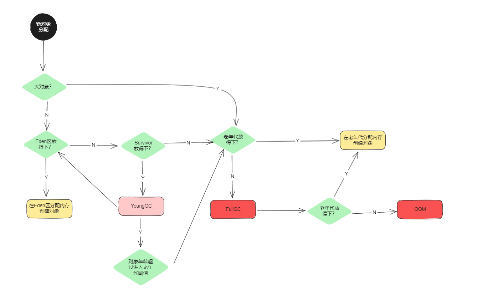

# ✅JVM 中一次完整的 GC 流程是怎样的？

# 典型回答

一次完整的GC流程大致如下，基于JDK 1.8：

一般来说，GC的触发是在对象分配过程中，当一个对象在创建时，他会根据他的大小决定是进入年轻代或者老年代。如果他的大小超过`-XX:PretenureSizeThreshold`就会被认为是大对象，直接进入老年代，否则就会在年轻代进行创建。（PretenureSizeThreshold默认是0，也就是说，默认情况下对象不会提前进入老年代，而是直接在新生代分配。然后就GC次数和基于动态年龄判断来进入老年代。）

在年轻代创建对象，会发生在Eden区，但是这个时候有可能会因为Eden区内存不够，这时候就会尝试触发一次YoungGC。（会在YoungGC前做一次空间分配担保，如果失败可能直接触发FullGC）

年轻代采用的是标记复制算法，主要分为，标记、复制、清除三个步骤，会从GC Root开始进行存活对象的标记，然后把Eden区和Survivor区复制到另外一个Survivor区。然后再把Eden和From Survivor区的对象清理掉。

这个过程，可能会发生两件事情，第一个就是Survivor有可能存不下这些存活的对象，这时候就会进行空间分配担保。如果担保成功了，那么就没什么事儿，正常进行Young GC就行了。但是如果担保失败了，说明老年代可能也不够了，这时候就会触发一次FullGC了。

[✅新生代如果只有一个Eden+一个Survivor可以吗？](https://www.yuque.com/hollis666/qfgwk3/eigm8iqgpwmd2eg8#rx6Hh)

还会发生第二件事情就是，在这个过程中，会进行对象的年龄判断，如果他经过一定次数的GC之后，还没有被回收，那么这个对象就会被放到老年代当中去。

而老年代如果不够了，或者担保失败了，那么就会触发老年代的GC，一般来说，现在用的比较多的老年代的垃圾收集器是CMS或者G1，他们采用的都是三色标记法。

也就是分为四个阶段：初始标记、并发标记、重新标记、及并发清理。

老年代在做FullGC之后，如果空间还是不够，那就要触发OOM了。

> 更新: 2024-04-18 22:46:49  
> 原文: <https://www.yuque.com/hollis666/qfgwk3/nm3u0khcxyc42u9q>