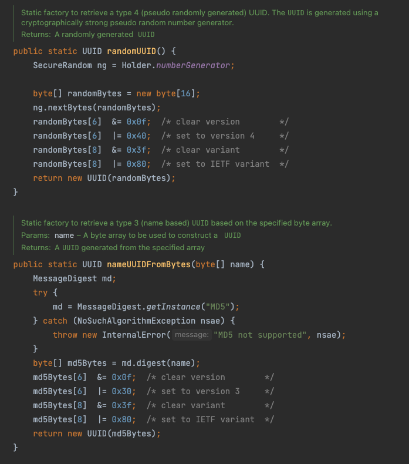

# ✅什么是UUID，能保证唯一吗？

# 典型回答

**UUID(Universally Unique Identifier)全局唯一标识符，是指在一台机器上生成的数字，它的目标是保证对在同一时空中的所有机器都是唯一的。**

****

UUID 的生成是基于一定算法，通常使用的是随机数生成器或者基于时间戳的方式，生成的 UUID 由 32 位 16 进制数表示，共有 128 位（标准的UUID格式为：xxxxxxxx-xxxx-xxxx-xxxx-xxxxxxxxxxxx (8-4-4-4-12)，共32个字符）

**由于 UUID 是由 MAC 地址、时间戳、随机数等信息生成的，因此 UUID 具有极高的唯一性，可以说是几乎不可能重复，但是在实际实现过程中，UUID有多种实现版本，他们的唯一性指标也不尽相同。**

****

UUID在具体实现上，有多个版本，有基于时间的UUID V1，基于随机数的 UUID V4等。

Java中的java.util.UUID生成的UUID是V3和V4两种：

#### 优缺点

**UUID的优点就是他的性能比较高，不依赖网络，本地就可以生成，使用起来也比较简单。**

****

**但是他也有两个比较明显的缺点，那就是长度过长和没有任何含义**。长度自然不必说，他有32位16进制数字。对于"550e8400-e29b-41d4-a716-446655440000"这个字符串来说，我想任何一个程序员都看不出其表达的含义。一旦使用它作为全局唯一标识，就意味着在日后的问题排查和开发调试过程中会遇到很大的困难。

#### 各个版本实现

**V1. 基于时间戳的UUID**

基于时间的UUID通过计算当前时间戳、随机数和机器MAC地址得到。**由于在算法中使用了MAC地址，这个版本的UUID可以保证在全球范围的唯一性。**

但与此同时，使用MAC地址会带来安全性问题，这就是这个版本UUID受到批评的地方。如果应用只是在局域网中使用，也可以使用退化的算法，以IP地址来代替MAC地址。

> MAC地址是与设备硬件直接关联的唯一标识符。通过获取到同一个 MAC 地址生成的大量UUID，可以被恶意用户或第三方通过反向工程解析出MAC地址，进而获取到设备的物理位置或用户身份信息。
>
> 在某些情况下，如果MAC地址被泄露，它可能被用于针对特定设备的网络攻击。
>

**V2. DCE(Distributed Computing Environment)安全的UUID**

和基于时间的UUID算法相同，但会把时间戳的前4位置换为POSIX的UID或GID，这个版本的UUID在实际中较少用到。

**V3. 基于名称空间的UUID(MD5)**

基于名称的UUID通过计算名称和名称空间的MD5散列值得到。

**这个版本的UUID保证了：相同名称空间中不同名称生成的UUID的唯一性；不同名称空间中的UUID的唯一性；相同名称空间中相同名称的UUID重复生成得到的结果是相同的。**

**V4. 基于随机数的UUID**

根据随机数，或者伪随机数生成UUID。该版本 UUID 采用随机数生成器生成，它可以保证生成的 UUID 具有极佳的唯一性。但是因为基于随机数的，所以，并不适合数据量特别大的场景。

**V5. 基于名称空间的UUID(SHA1)**

和版本3的UUID算法类似，只是散列值计算使用SHA1(Secure Hash Algorithm 1)算法。

#### 各个版本总结

可以简单总结一下，Version 1和Version 2 这两个版本的UUID，主要基于时间和MAC地址，所以比较适合应用于分布式计算环境下，具有高度唯一性。

Version 3和 Version 5 这两种UUID都是基于名称空间的，所以在一定范围内是唯一的，而且如果有需要生成重复UUID的场景的话，这两种是可以实现的。

Version 4 这种是最简单的，只是基于随机数生成的，但是也是最不靠谱的。适合数据量不是特别大的场景下

> 更新: 2024-07-19 20:25:21  
> 原文: <https://www.yuque.com/hollis666/qfgwk3/pi2zfc9ykug141im>