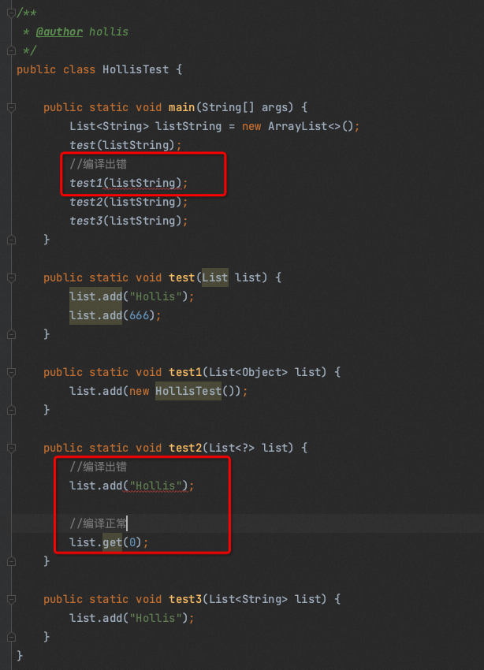

# ✅什么是泛型？有什么好处？

# 典型回答
Java泛型（generics） 是JDK 5中引入的一个新特性，允许在定义类和接口的时候使用类型参数（type parameter）。声明的类型参数在使用时用具体的类型来替换。泛型最主要的应用是在JDK 5中的新集合类框架中。


泛型的好处有两个：

1. 方便：可以提高代码的复用性。以List接口为例，我们可以将String、Integer等类型放入List中，如不用泛型，存放String类型要写一个List接口，存放Integer要写另外一个List接口，泛型可以很好的解决这个问题
2. 安全：在泛型出之前，通过Object实现的类型转换需要在运行时检查，如果类型转换出错，程序直接GG，可能会带来毁灭性打击。而泛型的作用就是在编译时做类型检查，这无疑增加程序的安全性

# 知识扩展
## 泛型是如何实现的
Java中的泛型通过**类型擦除**的方式来实现，通俗点理解，就是通过语法糖的形式，在.java->.class转换的阶段，将List<String>擦除调转为List的手段。换句话说，Java的泛型只在编译期，Jvm是不会感知到泛型的。


[什么是类型擦除？](https://www.yuque.com/hollis666/qfgwk3/qcn00m)


## 类型擦除的缺点有哪些？
1. 泛型不可以重载
2. 泛型异常类不可以多次catch
3. 泛型类中的静态变量也只有一份，不会有多份

## 对泛型通配符的理解
[✅泛型中上下界限定符extends 和 super有什么区别？](https://www.yuque.com/hollis666/qfgwk3/wi2kt7)

## List<?>, List<Object>, List之间的区别
1. List<?> 是一个未知类型的List，而List<Object> 其实是任意类型的List。可以把List<String>, List<Integer>赋值给List<?>，却不能把List<String>赋值给 List<Object>
2. 可以把任何带参数的类型传递给原始类型List，但却不能把List<String>赋值给List<Object>，因为会产生编译错误（不支持协变）
3. List<?>由于不确定列表中元素的具体类型，因此只能从这种列表中读取数据，而不能往里面添加除了 null 之外的任何元素。





## 在泛型为Integer的ArrayList中存放一个String类型的对象


通过反射可以实现：


```java
public void test() throws Exception {
    ArrayList<Integer> list = new ArrayList<Integer>();
    Method method = list.getClass().getMethod("add", Object.class);
    method.invoke(list, "Java反射机制实例");
    System.out.println(list.get(0));
}
```

## 
## 对数组协变和泛型非协变的理解
所谓协变，可以简单理解为因为Object是String的父类，所以Object[]同样是String[]的父类，这种情况Java是允许的；但是对于泛型来说，List<Object>和List<String>半毛钱关系都没有

为什么要这样设计呢，如果泛型允许协变（实际上以下代码第一步就会编译失败），考虑如下例子：

```java
List<Object> a = new List<String>();
a.add(1); // 允许协变，可以装进来
String s = a.get(0); // 编译报错
```

但是，为什么泛型不允许协变，而数组允许协变呢？原因有二：

1. 因为数组设计之初没有泛型，为了兼容考虑，如`Arrays.equals(Object[], Object[])`方法，是时代无奈的产物
2. 数组也属于对象，它记录了引用实际的类型，在放入数组的时候，如果类型不一样就会报错，而不是等到拿出来的时候才发现问题，相对来说安全一点


> 更新: 2024-03-18 23:17:00  
> 原文: <https://www.yuque.com/hollis666/qfgwk3/syhevb>