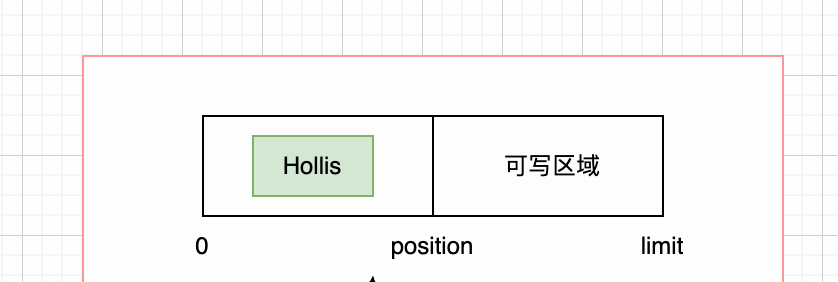
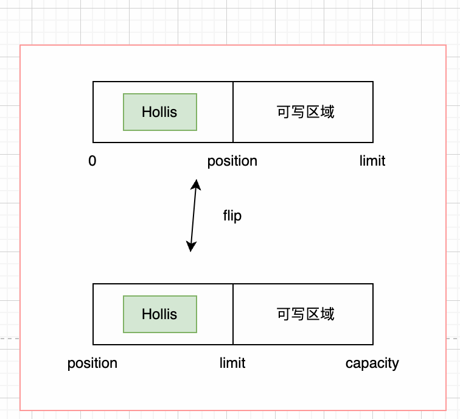
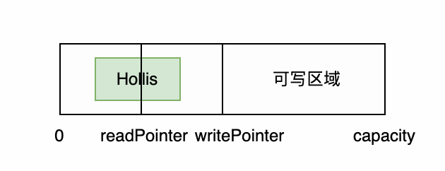

# ✅Netty的Buffer为什么好用

# 典型回答
在网络编程中，基本都是基于TCP报文的字节流的操作，所以Java的NIO又新增了ByteBuffer，只不过Java原生的ByteBuffer，非常难操作，也不能扩缩容，所以Netty又重新封装了自己的Bytebuf，除了性能上的优势之外，Netty的Buffer在使用上相对于NIO也非常简洁，有如下特点：

## 动态扩缩容
顾名思义，Netty中的ByteBuffer可以像Java中的ArrayList一样，根据写入数据的字节数量，自动扩容。代码如下所示：

```java
final void ensureWritable0(int minWritableBytes) {
    final int writerIndex = writerIndex();
    final int targetCapacity = writerIndex + minWritableBytes;
    // using non-short-circuit & to reduce branching - this is a hot path and targetCapacity should rarely overflow
    if (targetCapacity >= 0 & targetCapacity <= capacity()) {
        ensureAccessible();
        return;
    }
    if (checkBounds && (targetCapacity < 0 || targetCapacity > maxCapacity)) {
        ensureAccessible();
        throw new IndexOutOfBoundsException(String.format(
                "writerIndex(%d) + minWritableBytes(%d) exceeds maxCapacity(%d): %s",
                writerIndex, minWritableBytes, maxCapacity, this));
    }

    // Normalize the target capacity to the power of 2.
    final int fastWritable = maxFastWritableBytes();
    int newCapacity = fastWritable >= minWritableBytes ? writerIndex + fastWritable
            : alloc().calculateNewCapacity(targetCapacity, maxCapacity);

    // Adjust to the new capacity. 【此处进行扩容】
    capacity(newCapacity);
}
```

这个在编写代码的时候，满足ByteBuf最大缓冲区的情况下，我们可以毫无顾忌地调用#write方法增加字节，而不用手动去check容量满足，然后去重新申请

## 读写指针代替#flip
### 原生ByteBuffer的弊端
Java原生的ByteBuffer的数据结构，分为limit，capacity两个指针，如果我们写入“Hollis”之后，ByteBuffer的内容如下：



此时，如果我们要从该ByteBuffer中read数据，ByteBuffer会默认从position开始读，这样就什么也读不到，所以我们必须调用#flip方法，将position指针移动，如下：



这样我们才可以读到“Hollis”这个数据，万一我们调用的时候忘记使用flip，就会很坑爹。

### Netty的ByteBuf
Netty自带的ByteBuf通过读写双指针避免了上面的问题，假如我们写入“Hollis”后，ByteBuf的内容如下：


在写入的同时，我们可以直接通过readPointer读取数据，如下所示：



在这个过程中，我们完全不用像JavaNIO的ByteBufer一样，感知其结构内部的操作，也不用调用flip，随意的读取和写入即可。

同时，假如我们读Hollis这个数据，读到了一半，还剩下“is”没有读完，我们可以调用discardReadBytes方法将指针移位，为可写区域增加空间，如下所示：


### 多种ByteBuf实现
Netty根据不同的场景，有不同的ByteBuf实现，主要的几种分别是：Pooled，UnPooled，Direct，Heap，列表格如下：

| | Pooled | UnPooled |
| --- | --- | --- |
| HeapByteBuf | 业务处理使用+高并发 | 业务处理使用+正常流量 |
| DireactByteBuf | Socket相关操作使用+高并发 | Socket相关操作使用+正常流量 |


当然Netty中的Buffer性能相比于Java NIO的Buffer也更强，譬如我们熟知的Zero-Copy等，这个我们放到另一篇中剖析


> 更新: 2024-03-18 23:21:06  
> 原文: <https://www.yuque.com/hollis666/qfgwk3/qnyxsvlqd1xa2wis>