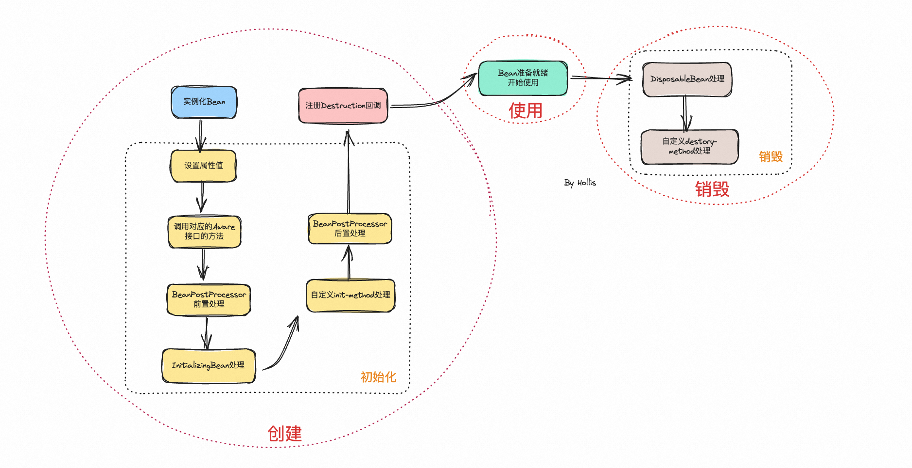

# ✅Spring Bean的生命周期是怎么样的？

# 典型回答


一个Spring的Bean从出生到销毁的全过程就是他的整个生命周期，那么经历以下几个阶段：




**整个生命周期可以大致分为3个大的阶段，分别是：****<font style="color:#DF2A3F;">创建、使用、销毁</font>****。还可以进一步分为5个小的阶段：****<u>实例化、初始化、注册Destruction回调、Bean的正常使用以及Bean的销毁</u>****。**

****

> 有人把设置属性值这一步单独拿出来了，主要是因为在源码中doCreateBean是先调了populateBean进行属性值的设置，然后再调initializeBean进行各种前置&后置处理。但是其实属性的设置其实就是初始化的一部分。要不然初始化啥呢？
>
> 
>
> 有人也把注册Destruction回调放到销毁这一步了，其实是不对的，其实他不算初始化的一步，也不应该算作销毁的一个过程，他虽然和销毁有关，但是他是在创建的这个生命周期中做的。
>


具体到代码方面，可以参考以下这个更加详细的过程介绍，我把具体实现的代码位置列出来了。


1. **实例化Bean**：
    - Spring容器首先创建Bean实例。
    - 在**<font style="color:#ECAA04;">AbstractAutowireCapableBeanFactory</font>**类中的**createBeanInstance**方法中实现
2. **设置属性值**：
    - Spring容器注入必要的属性到Bean中。
    - 在**<font style="color:#ECAA04;">AbstractAutowireCapableBeanFactory</font>**的**populateBean**方法中处理
3. **检查Aware**：
    - 如果Bean实现了BeanNameAware、BeanClassLoaderAware等这些Aware接口，Spring容器会调用它们。
    - 在**<font style="color:#ECAA04;">AbstractAutowireCapableBeanFactory</font>**的**initializeBean**方法中调用
4. **调用BeanPostProcessor的前置处理方法**：
    - 在Bean初始化之前，允许自定义的BeanPostProcessor对Bean实例进行处理，如修改Bean的状态。BeanPostProcessor的postProcessBeforeInitialization方法会在此时被调用。
    - 由**<font style="color:#ECAA04;">AbstractAutowireCapableBeanFactory</font>**的**applyBeanPostProcessorsBeforeInitialization**方法执行。
5. **调用InitializingBean的afterPropertiesSet方法**：
    - 提供一个机会，在所有Bean属性设置完成后进行初始化操作。如果Bean实现了InitializingBean接口，afterPropertiesSet方法会被调用。
    - 在**<font style="color:#ECAA04;">AbstractAutowireCapableBeanFactory</font>**的**invokeInitMethods**方法中调用。
6. **调用自定义init-method方法：**
    - 提供一种配置方式，在XML配置中指定Bean的初始化方法。如果Bean在配置文件中定义了初始化方法，那么该方法会被调用。
    - 在**<font style="color:#ECAA04;">AbstractAutowireCapableBeanFactory</font>**的**invokeInitMethods**方法中调用。
7. **调用BeanPostProcessor的后置处理方法**：
    - 在Bean初始化之后，再次允许BeanPostProcessor对Bean进行处理。BeanPostProcessor的postProcessAfterInitialization方法会在此时被调用。
    - 由**<font style="color:#ECAA04;">AbstractAutowireCapableBeanFactory</font>**的**applyBeanPostProcessorsAfterInitialization**方法执行
8. **注册****<font style="color:rgb(15, 15, 15);">Destruction回调：</font>**
    - 如果Bean实现了DisposableBean接口或在Bean定义中指定了自定义的销毁方法，Spring容器会为这些Bean注册一个销毁回调，确保在容器关闭时能够正确地清理资源。
    - 在**<font style="color:#ECAA04;">AbstractAutowireCapableBeanFactory</font>**类中的**registerDisposableBeanIfNecessary**方法中实现
9. **Bean准备就绪**：
    - 此时，Bean已完全初始化，可以开始处理应用程序的请求了。
10. **调用DisposableBean的destroy方法**：
    - 当容器关闭时，如果Bean实现了DisposableBean接口，destroy方法会被调用。
    - 在**<font style="color:#ECAA04;">DisposableBeanAdapter</font>**的**destroy**方法中实现
11. **调用自定义的destory-method**
    - 如果Bean在配置文件中定义了销毁方法，那么该方法会被调用。
    - 在**<font style="color:#ECAA04;">DisposableBeanAdapter</font>**的**destroy**方法中实现


可以看到，整个Bean的创建的过程都依赖于**<font style="color:#ECAA04;">AbstractAutowireCapableBeanFactory</font>**这个类，而销毁主要依赖**<font style="color:#ECAA04;">DisposableBeanAdapter</font>**这个类。


AbstractAutowireCapableBeanFactory 的入口处，doCreateBean的核心代码如下，其中包含了实例化、设置属性值、初始化Bean以及注册销毁回调的几个核心方法。


```java
protected Object doCreateBean(final String beanName, final RootBeanDefinition mbd, final Object[] args)
			throws BeanCreationException {

		// 实例化bean
		BeanWrapper instanceWrapper = null;
		if (instanceWrapper == null) {
			instanceWrapper = createBeanInstance(beanName, mbd, args);
		}

        // ...

		Object exposedObject = bean;
		try {
            //设置属性值
			populateBean(beanName, mbd, instanceWrapper);
			if (exposedObject != null) {
                //初始化Bean
				exposedObject = initializeBean(beanName, exposedObject, mbd);
			}
		}
		
    	// ...

		// 注册Bean的销毁回调
		try {
			registerDisposableBeanIfNecessary(beanName, bean, mbd);
		}

		return exposedObject;
	}
```


而**<font style="color:#ECAA04;">DisposableBeanAdapter</font>**的destroy方法中核心内容如下：

****

```java
@Override
public void destroy() {
    if (this.invokeDisposableBean) {
            // ...
            ((DisposableBean) bean).destroy();
        }
        // ...
    }

    if (this.destroyMethod != null) {
        invokeCustomDestroyMethod(this.destroyMethod);
    }
    else if (this.destroyMethodName != null) {
        Method methodToCall = determineDestroyMethod();
        if (methodToCall != null) {
            invokeCustomDestroyMethod(methodToCall);
        }
    }
}
```


> 更新: 2024-04-18 22:12:56  
> 原文: <https://www.yuque.com/hollis666/qfgwk3/gpl60ga0c996vmw3>