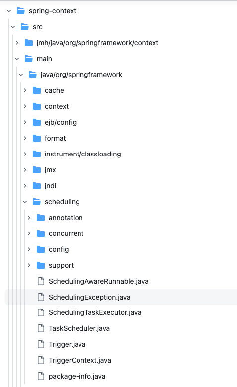
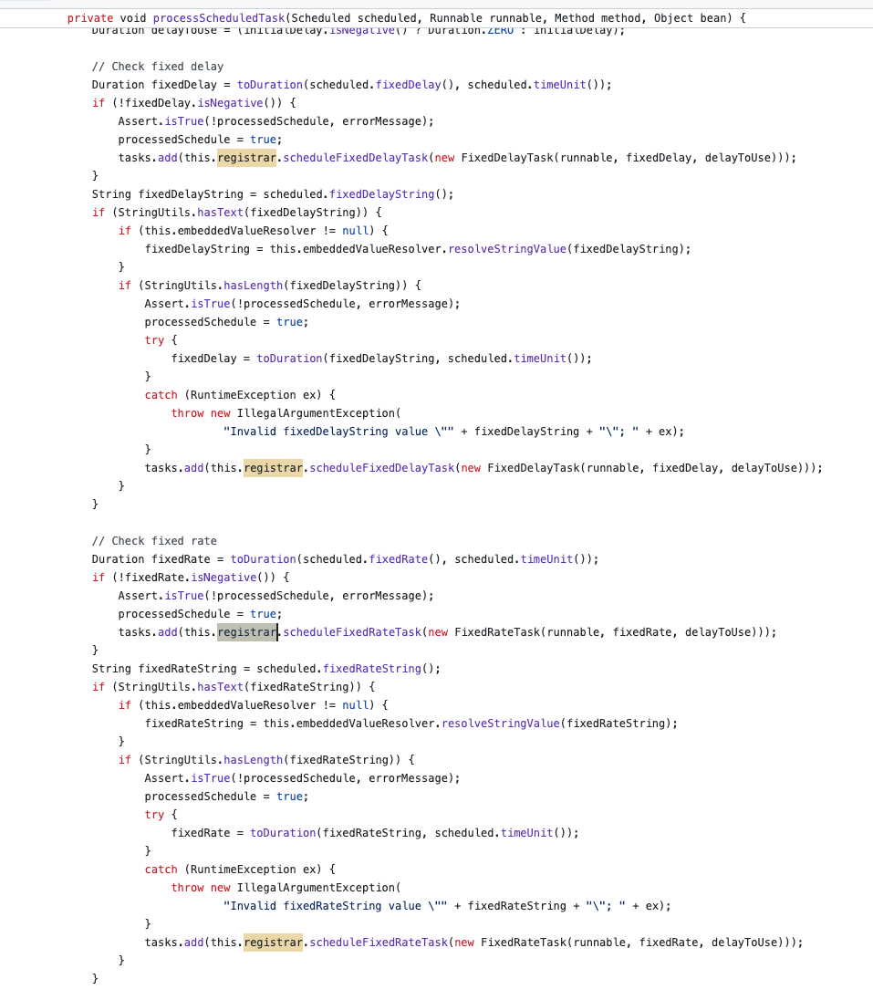
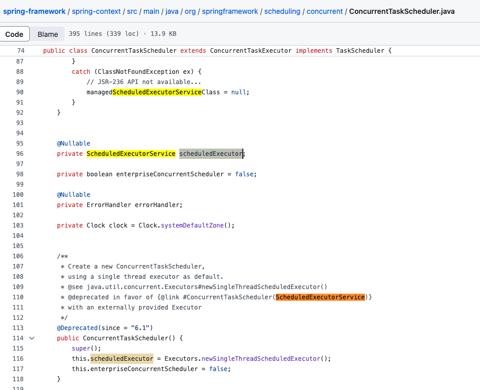

# ✅介绍下@Scheduled的实现原理以及用法

# 典型回答
Spring 的 `@Scheduled` 注解用于在 Spring 应用中配置和执行定时任务。


```java
import org.springframework.scheduling.annotation.Scheduled;
import org.springframework.stereotype.Component;

@Component
public class ScheduledTasks {

    // 每隔5秒执行一次
    @Scheduled(fixedRate = 5000)
    public void performTask() {
        System.out.println("fixedRate task " + System.currentTimeMillis());
    }

    // 上一个任务完成后等待5秒再执行
    @Scheduled(fixedDelay = 5000)
    public void performDelayedTask() {
        System.out.println("fixedDelay task " + System.currentTimeMillis());
    }

    // 每天晚上12点执行
    @Scheduled(cron = "0 0 0 * * ?")
    public void performTaskUsingCron() {
        System.out.println("corn task " + System.currentTimeMillis());
    }
}
```


Spring 的定时任务调度框架在 spring-context 包中，所有的类都在 scheduling 包中：




ScheduledAnnotationBeanPostProcessor是和这个定时任务调度有关的一个 bean 的后置处理器，这里面有着处理`@Scheduled`的逻辑：


```java
@Override
public Object postProcessAfterInitialization(Object bean, String beanName) {
    if (bean instanceof AopInfrastructureBean || bean instanceof TaskScheduler ||
            bean instanceof ScheduledExecutorService) {
        // Ignore AOP infrastructure such as scoped proxies.
        return bean;
    }

    Class<?> targetClass = AopProxyUtils.ultimateTargetClass(bean);
    if (!this.nonAnnotatedClasses.contains(targetClass) &&
            AnnotationUtils.isCandidateClass(targetClass, List.of(Scheduled.class, Schedules.class))) {
        Map<Method, Set<Scheduled>> annotatedMethods = MethodIntrospector.selectMethods(targetClass,
                (MethodIntrospector.MetadataLookup<Set<Scheduled>>) method -> {
                    Set<Scheduled> scheduledAnnotations = AnnotatedElementUtils.getMergedRepeatableAnnotations(
                            method, Scheduled.class, Schedules.class);
                    return (!scheduledAnnotations.isEmpty() ? scheduledAnnotations : null);
                });
        if (annotatedMethods.isEmpty()) {
            this.nonAnnotatedClasses.add(targetClass);
            if (logger.isTraceEnabled()) {
                logger.trace("No @Scheduled annotations found on bean class: " + targetClass);
            }
        }
        else {
            // Non-empty set of methods
            annotatedMethods.forEach((method, scheduledAnnotations) ->
                    scheduledAnnotations.forEach(scheduled -> processScheduled(scheduled, method, bean)));
            if (logger.isTraceEnabled()) {
                logger.trace(annotatedMethods.size() + " @Scheduled methods processed on bean '" + beanName +
                        "': " + annotatedMethods);
            }
        }
    }
    return bean;
}

```


上面的第9-33行，就是针对`@Scheduled`的处理逻辑，并且在第27行，我们看到，他把找到的标注了`@Scheduled`的方法交给了`processScheduled`方法进行处理。最终会执行到`processScheduledTask`方法，这个方法内容有点长，这里贴一下截图 （[https://github.com/spring-projects/spring-framework/blob/main/spring-context/src/main/java/org/springframework/scheduling/annotation/ScheduledAnnotationBeanPostProcessor.java#L392](https://github.com/spring-projects/spring-framework/blob/main/spring-context/src/main/java/org/springframework/scheduling/annotation/ScheduledAnnotationBeanPostProcessor.java#L392) ）：





从上图可以看到，这里根据不同的任务类型，调用了 registrar 的不同的调度方法，这个registrar是啥呢？其实就是`ScheduledTaskRegistrar`，


比如我们看下fixedRate类型的任务调度方式：


```java
/**
 * Schedule the specified fixed-rate task, either right away if possible
 * or on initialization of the scheduler.
 * @return a handle to the scheduled task, allowing to cancel it
 * (or {@code null} if processing a previously registered task)
 * @since 5.0.2
 */
@Nullable
public ScheduledTask scheduleFixedRateTask(FixedRateTask task) {
    ScheduledTask scheduledTask = this.unresolvedTasks.remove(task);
    boolean newTask = false;
    if (scheduledTask == null) {
        scheduledTask = new ScheduledTask(task);
        newTask = true;
    }
    if (this.taskScheduler != null) {
        Duration initialDelay = task.getInitialDelayDuration();
        if (initialDelay.toNanos() > 0) {
            Instant startTime = this.taskScheduler.getClock().instant().plus(initialDelay);
            scheduledTask.future =
                    this.taskScheduler.scheduleAtFixedRate(task.getRunnable(), startTime, task.getIntervalDuration());
        }
        else {
            scheduledTask.future =
                    this.taskScheduler.scheduleAtFixedRate(task.getRunnable(), task.getIntervalDuration());
        }
    }
    else {
        addFixedRateTask(task);
        this.unresolvedTasks.put(task, scheduledTask);
    }
    return (newTask ? scheduledTask : null);
}
```


这里面是将任务给到taskScheduler进行调度执行了，这里的taskScheduler，默认是ConcurrentTaskScheduler。

****

ConcurrentTaskScheduler 是 TaskScheduler 接口的一个实现，可以并发调度多个任务，确保任务能够按时执行，它是借助 ScheduledExecutorService作为线程池来进行并发调度的。


**  
**

在 Spring 6.1之前，如果没有指定线程池，这里默认会创建一个单线程的线程池。但是这个方法在6.1之后已经废弃了，现在使用的是要传入ScheduledExecutorService的构造函数来指定一个线程池。

****

```java
public ConcurrentTaskScheduler(@Nullable ScheduledExecutorService scheduledExecutor) {
    super(scheduledExecutor);
    if (scheduledExecutor != null) {
        initScheduledExecutor(scheduledExecutor);
    }
}

```

## 扩展知识
### @Scheduled用法


1. 定义一线程池


```java
import org.springframework.context.annotation.Bean;
import org.springframework.context.annotation.Configuration;
import org.springframework.scheduling.concurrent.ThreadPoolTaskScheduler;

@Configuration
public class SchedulerConfig {

    @Bean
    public ThreadPoolTaskScheduler taskScheduler() {
        ThreadPoolTaskScheduler scheduler = new ThreadPoolTaskScheduler();
        scheduler.setPoolSize(10); // 设置线程池大小
        scheduler.setThreadNamePrefix("scheduled-task-"); // 设置线程名前缀
        scheduler.setWaitForTasksToCompleteOnShutdown(true); // 优雅停机
        scheduler.setAwaitTerminationSeconds(60); // 等待终止时间
        return scheduler;
    }
}

```


2. 启用定时任务并指定线程池


```java
@Configuration
@EnableScheduling
public class SchedulerConfig implements SchedulingConfigurer {

    @Autowired
    private ThreadPoolTaskScheduler taskScheduler;

    @Override
    public void configureTasks(ScheduledTaskRegistrar taskRegistrar) {
        taskRegistrar.setTaskScheduler(taskScheduler);
    }
}

```


3. 定义定时任务：


```java
import org.springframework.scheduling.annotation.Scheduled;
import org.springframework.stereotype.Component;

@Component
public class ScheduledTasks {

    // 每隔5秒执行一次
    @Scheduled(fixedRate = 5000)
    public void performTask() {
        System.out.println("Regular task performed at " + System.currentTimeMillis());
    }

    // 上一个任务完成后等待5秒再执行
    @Scheduled(fixedDelay = 5000)
    public void performDelayedTask() {
        System.out.println("Delayed task performed at " + System.currentTimeMillis());
    }

    // 每天晚上12点执行
    @Scheduled(cron = "0 0 0 * * ?")
    public void performTaskUsingCron() {
        System.out.println("Scheduled task using cron expression at " + System.currentTimeMillis());
    }
}
```


+ `fixedRate`：以固定的时间间隔执行任务，从上一个任务开始时间算起。
+ `fixedDelay`：以上一个任务的完成时间算起，延迟固定的时间间隔后执行。
+ `cron`：使用 Cron 表达式定义复杂的定时任务。


> 更新: 2024-06-01 12:18:05  
> 原文: <https://www.yuque.com/hollis666/qfgwk3/fvisrutmltymyng2>