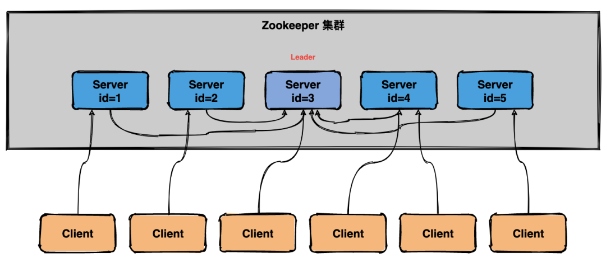

# ✅Zookeeper是选举机制是怎样的？

# 典型回答

ZooKeeper的选举机制是其实现分布式协调一致性的核心部分，它确保在ZooKeeper集群中选择一个Leader节点来协调和处理客户端请求。

一次完整的选举大概要经历以下几个步骤：

**初始化阶段**： 在一个ZooKeeper集群中，每个Follower节点都可以成为Leader。初始状态下，所有Follower节点都是处于"LOOKING"状态，即寻找Leader。每个节点都会监视集群中的其他节点，以侦听Leader选举消息。

**提名和投票**： 当一个节点启动时，它会向其他节点发送投票请求，称为提名。节点收到提名后可以选择投票支持这个提名节点，也可以不投票。每个节点只能在一个选举周期内投出一票。

在提名过程中，所有的投票者都遵守一个原则，那就是**遇强投强**。

**怎么算强？**

在Zookeeper中，通过数据是否足够新来判断这个节点是不是够强。在 Zookeeper 中以事务id（zxid）来标识数据的新旧程度，节点的zxid越大代表这个节点的数据越新，也就代表这个节点能力越强。

那么在投票过程中，节点首先会认为自己是最强的，所以他会在投票时先投自己一票，然后把自己的投票信息广播出去，这里面包含了**zxid**和**sid**，zxid就是自己的事务ID，sid就是标识出自己是谁的唯一标识。

这样集群中的节点们就会不断收到别人发过来的投票结果，然后这个节点就会拿别人的zxid和自己的zxid进行比较，如果别人的zxid更大， 说明他的数据更新，那么就会重新投票，把zxid和sid都换成别人的信息再发出去。

**选举过程**： 选举过程分为多个轮次，每个轮次被称为一个"选举周期"。在每个选举周期中，节点根据投票数来选择新的Leader候选者。如果一个候选者获得了大多数节点（超过半数）的投票，那么它就会成为新的Leader。否则，没有候选者能够获得足够的投票，那么这个选举周期失败，所有节点会继续下一个选举周期。

**Leader确认**： 一旦一个候选者获得了大多数节点的投票，它就会成为新的Leader。这个Leader会向其他节点发送Leader就绪消息，告知它们自己已经成为Leader，并且开始处理客户端的请求。

**集群同步**： 一旦新的Leader选举完成，其他节点会与新Leader同步数据，确保所有节点在一个一致的状态下运行。这个同步过程也包括了未完成的客户端请求，以保证数据的一致性。

# 扩展知识

## 选举状态

在整个选举过程中，节点的状态可能有4种，分别是

LOOKING，竞选状态。

FOLLOWING，随从状态，同步leader状态，参与投票。

OBSERVING，观察状态，同步leader状态，但是不参与投票。

LEADING，领导者状态。

## Leader选举的场景

ZooKeeper其实会在两种情况下进行Leader选举，第一种是集群的启动阶段，第二个是Leader失效了的情况。

**启动阶段**： 当整个ZooKeeper集群启动时，这时候还没有Leader，那么就会进行一次Leader选举。

**Leader失效**：如果当前的Leader节点由于某种原因（如宕机、网络故障、连接丢失等）失效，剩余的节点会开始一个新的选举周期来选择新的Leader。

### 启动阶段的Leader选举

假设一个 Zookeeper 集群中有5台服务器，id从1到5编号，并且它们都是最新启动的，没有历史数据。

  

假设服务器依次启动，那么大致的选举过程：

**服务器1启动**，进入LOOKING状态，开始发起投票，服务器1投自己一票，<zxid=1,sid=1>

> 投票结果：服务器1，1票
>
> 服务器1状态：LOOKING
>

因为投票总数未过半，则继续选举。

**服务器2启动**，进入LOOKING状态，开始投票，服务器2投自己一票<zxid=2,sid=2>，并收到服务器1的投票<zxid=1,sid=1>。同时服务器1也收到服务器2的投票<zxid=2,sid=2>，经比对，服务器2的zxid更大，于是服务器1改票<zxid=2,sid=2>

> 投票结果：服务器2，2票
>
> 服务器1状态：LOOKING
>
> 服务器2状态：LOOKING
>

因为投票总数未过半，则继续选举。

**服务器3启动**，同样经过和服务器2一样的过程，之后服务器1，服务器2开始改投服务器3，

发起一次选举，服务器1、2、3先投自己一票，然后因为服务器3的id最大，两者更改选票投给为服务器3；

> 投票结果：服务器3，3票
>
> 服务器1状态：FOLLOWING
>
> 服务器2状态：FOLLOWING
>
> 服务器3状态：LEADING
>

**服务器4启动**，发现集群中已经有Leader，则自己变为Follower，进入FOLLOWING状态。

> 服务器1状态：FOLLOWING
>
> 服务器2状态：FOLLOWING
>
> 服务器3状态：LEADING
>
> 服务器4状态：FOLLOWING
>

**服务器5启动，**和服务器4一样，进入FOLLOWTING状态。

> 服务器1状态：FOLLOWING
>
> 服务器2状态：FOLLOWING
>
> 服务器3状态：LEADING
>
> 服务器4状态：FOLLOWING
>
> 服务器5状态：FOLLOWING
>

至此，完成Leader选举，服务器3当选！ 

### Leader失效重新选举

初始状态下服务器3当选为Leader，此时每个服务器上zxid可能都不一样，server1为99，server2为102，server4为100，server5为101，假设现在服务器3故障宕机了

服务器3宕机后，各个Follower节点会进入到LOOKING状态，开始进行选举投票。

每个服务器都会投自己一票，并且把自己的选票都广播出去：

<zxid=88,sid=1>

<zxid=102,sid=2>

<zxid=100,sid=4>

<zxid=101,sid=5>

并且所有人在接收到其他的人投票后，会根据选票情况进行改选，最终zxid=102的这个服务器会当选。  

PS：本文中的例子参考 ： [https://mp.weixin.qq.com/s/wOcnhF5AjMXliXAmroYSLA](https://mp.weixin.qq.com/s/wOcnhF5AjMXliXAmroYSLA)

> 更新: 2024-05-09 21:26:28  
> 原文: <https://www.yuque.com/hollis666/qfgwk3/tsfqf463g4mbh41k>