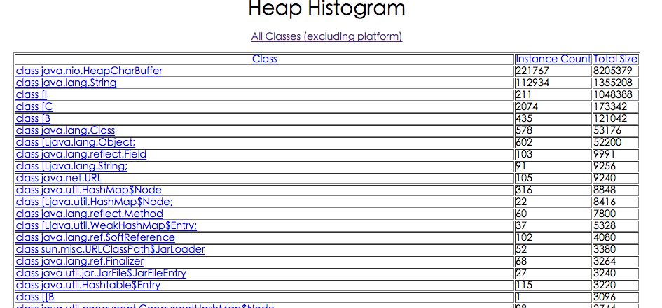

# ✅jhat有什么用，如何用他分析堆dump

# 典型回答


jhat(Java Heap Analysis Tool),是一个用来分析java的堆情况的命令。使用jmap生成的Java堆的Dump文件可以用jhat命令将其转成html的形式，然后通过http访问可以查看堆情况。


jhat命令解析会Java堆dump并启动一个web服务器，然后就可以在浏览器中查看堆的dump文件了。


# 扩展知识


## 使用


<font style="color:rgb(51, 51, 51);">使用</font>jmap<font style="color:rgb(51, 51, 51);">命令生成dump：</font>

<font style="color:rgb(51, 51, 51);"></font>

```c
$ jmap -dump:format=b,file=heapDump 62247
Dumping heap to /Users/hollis/workspace/test/heapDump ...
Heap dump file created
```


<font style="color:rgb(51, 51, 51);">以上命令可以将进程62247的堆dump文件导出到heapDump文件中。查看当前目录就能看到heapDump文件。</font>

<font style="color:rgb(51, 51, 51);"></font>

<font style="color:rgb(51, 51, 51);">接下来，解析Java堆转储文件,并启动一个 web server：</font>

<font style="color:rgb(51, 51, 51);"></font>

```c
$ jhat heapDump

Reading from heapDump...
Dump file created Thu Jan 21 18:59:51 CST 2016
Snapshot read, resolving...
Resolving 341297 objects...
Chasing references, expect 68 dots....................................................................
Eliminating duplicate references....................................................................
Snapshot resolved.
Started HTTP server on port 7000
Server is ready.
```


<font style="color:rgb(51, 51, 51);">使用jhat命令，就启动了一个http服务，端口是7000 ，然后在访问http://localhost:7000/</font>

<font style="color:rgb(51, 51, 51);">页面如下：</font>


接下来，就可以在浏览器里面看到dump文件之后就可以进行分析了。这个页面会列出当前进程中的所有对像情况。


该页面提供了几个查询功能可供使用：


```c
All classes including platform//
Show all members of the rootset
Show instance counts for all classes (including platform)
Show instance counts for all classes (excluding platform)
Show heap histogram
Show finalizer summary
Execute Object Query Language (OQL) query
```


<font style="color:rgb(51, 51, 51);">一般查看堆异常情况主要看这个两个部分：</font>

**<font style="color:rgb(51, 51, 51);">Show instance counts for all classes (excluding platform)</font>**<font style="color:rgb(51, 51, 51);">，平台外的所有对象信息。如下图：</font>


**<font style="color:rgb(51, 51, 51);">Show heap histogram</font>**<font style="color:rgb(51, 51, 51);"> </font><font style="color:rgb(51, 51, 51);">以树状图形式展示堆情况。如下图：</font>



<font style="color:rgb(51, 51, 51);">具体排查时需要结合代码，观察是否大量应该被回收的对象在一直被引用或者是否有占用内存特别大的对象无法被回收。</font>


> 更新: 2024-08-31 12:25:37  
> 原文: <https://www.yuque.com/hollis666/qfgwk3/nhd29y82stcf64bi>