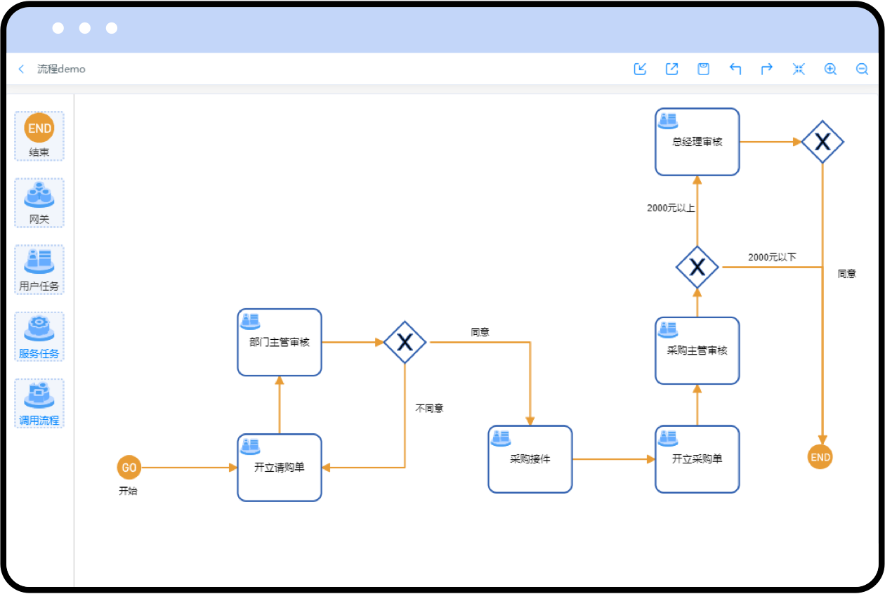

# ✅什么是流程引擎，请问流程引擎有什么优缺点？

# 典型回答

流程引擎（Process Engine） 是一种用于自动化、管理和执行业务流程的软件系统。它通过将业务逻辑抽象为可定义的流程模型（如工作流、审批流程、订单处理等），实现任务的自动流转、状态管理、条件分支处理以及人工与系统交互的协调。流程引擎通常基于标准化的流程建模语言（如BPMN 2.0），支持流程的设计、部署、执行和监控。（来自百度）

简单点说就是通过把一堆业务操作节点编排成一个固定的执行流程，让这个流程可以按照规定的方式执行，并且可以做到可视化查看和配置。最简单的流程就是审批流

  
 

像上面这种，可以编排业务节点、分支流程等等的。

它的最大的好处就是**可视化**，可以让非技术人员一眼就能看懂，甚至参与设计。

还有就是**标准化**，比如你要实现的是一个请假审批流程，那么只要有一套统一的流程，那么就可以避免在代码中硬编码，因为流程帮你把他们编排好了，比如第一步主管审批，第二步HR审批，第三步财务审批，如果请假超过10天，则上升到二级主管审批。

另外，如果流程是相对标准的，那么**可维护性**也会好一些，因为改动都是局部的，比如在一个节点中改代码，或者在流程中增删节点，全局影响是可控的。

还有人说流程引擎可以自动化减少人工干预，但是这个如果是硬编码也能做到，所以这个就还好，不算啥大优势。

另外，流程引擎做得好的，可以支持各种分支、循环、子流程、异步等等的，就比较灵活，当然，这个通过硬编码也能实现。

流程引擎并不是没有任何缺点的，他也是有一些局限性的。

比如特别简单的逻辑，用流程引擎反而会比较重。因为流程引擎的代码，其实是不太好找的，一个节点的代码看完，你不太好找下一个节点，要去配置文件中先找到下一个节点的配置，然后才能找到具体的代码实现，所以不如硬编码来的更加直接。

还有就是频繁改动、不统一的业务场景不适合流程引擎，那样就会导致流程爆炸，一大堆流程，每一个新场景都加一个流程，基本没啥可复用性，那就没意义了。

# 扩展知识

## 主流框架

**Activiti：**轻量级，支持BPMN 2.0标准，与Spring集成友好，社区活跃。

    - **适用场景**：中小型项目，快速实现工作流自动化。

****

**Camunda：**基于Activiti分支，增强了对BPMN和DMN（决策模型）的支持，提供强大的运维监控工具（Cockpit）。

    - **适用场景**：企业级复杂流程管理，需深度监控和优化的场景。

****

**Flowable：**Activiti的另一分支，简化了核心模块，性能更优，支持CMMN（案例管理模型）。

    - **适用场景**：需要高性能和轻量级引擎的中大型项目。

****

**jBPM：**Red Hat支持，与Drools规则引擎深度集成，适合复杂业务规则与流程结合的场景。

    - **适用场景**：金融、保险等需动态规则调整的领域。

  
 

> 更新: 2025-02-23 14:21:16  
> 原文: <https://www.yuque.com/hollis666/qfgwk3/uzi41t8m8ixcigb2>