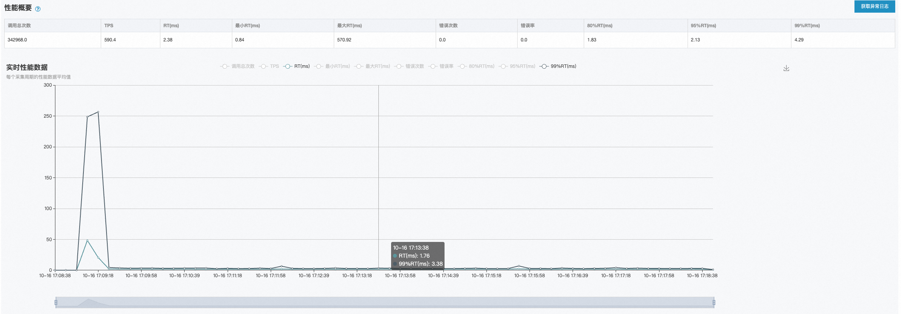
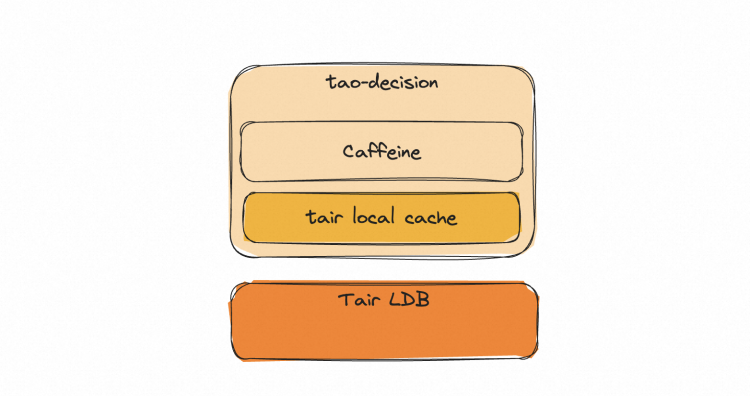
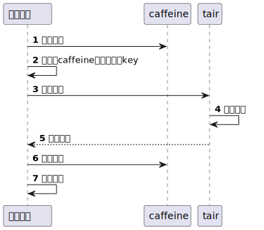

# 交易主链路提供风控决策要求RT 5ms的技术方案

## 背景


我在淘天集团的金融风控技术团队，我们需要支撑某个金融产品，在下单核心链路上进行风控的决策，但是上游给我们的RT只有5ms。我们之前的决策链路还是比较复杂的，上下游包含了多个系统，想要抗住这5ms的RT基本上是不可能的。


为了实现这个要求，我们单独做了一个前置决策，专门用来支持交易核心链路上的金融产品的风险防控及价格咨询。为了尽可能的提升性能，我们在过程中做了很多事情。最近业务已经上线了，也做了压测，基本满足了要求。于是总结一下本次的技术改造过程。


## 压测数据


机器：4台  
QPS：600（更新：同样的配置，后来我压到了3000，完全扛得住）  
RT：2.38ms





CPU：2.95%  
MEM：29%  
LOAD：0.05-0.25


## 调用链路


## 技术方案


整体的技术方案，主要做了这么多事情：**独立部署+单元化架构+内存决策+多级缓存+异步日志+批量读取+数据预读**


### 独立部署+单元化架构


单独创建一个应用，做单元化部署，避免和其他业务之间互相影响，可以快速迭代进行发布。


[✅什么是单元化架构？](https://www.yuque.com/hollis666/qfgwk3/eys76h45ig2g74o3)


前置决策：包含风控、定价等金融决策功能。  
同单元网络延迟：同机房0.2ms，跨机房0.8ms


### 内存决策


放弃原来的链路，改为内部自决策。数据从缓存读取，决策在内存进行。不外调，不外查。


### 多级缓存





本地缓存：Caffeine


+ 保存最近的决策因子——名单值  
Tair客户端本地缓存：tair local cache
+ 热点检测，针对热点数据做本地缓存  
Tair分布式缓存
+ 分布式缓存，做缓存数据持久化及一致性保障





代码：


```plain
@Override
public DecisionContext initContext(List<RiskAdmitRequest> riskAdmitRequests, String localCacheNamespace, int remoteCacheNamespace) {

    DecisionContext decisionContext = new DecisionContext();
    //初始化上下文
    decisionContext.setLocalCacheNamespace(localCacheNamespace);
    decisionContext.setRemoteCacheNamespace(remoteCacheNamespace);
    DecisionConfig decisionConfig = decisionConfigProperties.getDecisionConfig(localCacheNamespace);

    //key添加
    enrichKeys(decisionContext, riskAdmitRequests, decisionConfig);

    //从本地缓存中查询

    fetchLocalCache(decisionContext);

    //从分布式缓存中查询
    fetchRemoteCache(decisionContext);

    if (logger.isInfoEnabled()) {
        logger.info(decisionContext.printLog());
    }
    return decisionContext;
}
```


#### 缓存更新方案


离线数仓直接通过定时任务写数据到tair缓存中。（这里用了内部工具，就不展开说了）


任务调度：1200万数据，耗时7分钟


#### 缓存替换方案


采用增量更新，每天全量刷进Redis缓存中，数据不做主动删除。可避免和解决以下问题：  
1、如果当日调度失败，不会导致缓存被击穿。  
2、不需要做版本切换，版本切换和数据同步无法保证原子性，时效性也无法保证  
3、避免缓存刷新过程对应用自身造成影响


主要SQL如下：


```plain
-- 买家黑名单
insert overwrite table  tao_decision_cache  PARTITION(ds = '${bizdate}')
SELECT  CONCAT("JBZ_BL_BYR_" , user_id) as key
        ,CASE    blk_flag
                WHEN 'Y' THEN code_str
                ELSE NULL
        END AS value
FROM    b2b_risk.dwi_cf_tb_byr_jbz_item_detail_black_list_df
WHERE   ds = '${bizdate}'
```


产出数据如下：


直接把当日分区中的所有数据，直接刷入到Tair中，value为\N时会自动删除数据


#### tair local cache


本地创建了基于LRU的队列（使用LinkedHashMap实现），通过过期时间和队列大小两个方面对缓存entry的剔除进行控制。当达到队列大小阀值时，新进的entry会被LRU算法淘汰；当entry在队列中存在时间超过过期时间阀值时，也会被淘汰。


缺点：数据一致性问题


### 异步日志


使用异步日志进行输出时，日志输出语句与业务逻辑语句并不是在同一个线程中运行，而是有专门的线程用于进行日志输出操作，处理业务逻辑的主线程不用等待即可执行后续业务逻辑。这样即使日志没有完成输出，也不会影响程序的主业务，从而提高了程序的性能。


logback异步输出日志是通过AsyncAppender实现的。Logback的异步输出采用生产者消费者的模式，将生成的日志放入消息队列中，并将创建一个线程用于输出日志事件。


```plain
  <appender name="ASYNC-APPLICATION" class="ch.qos.logback.classic.AsyncAppender">
      <discardingThreshold>0</discardingThreshold>
      <queueSize>512</queueSize>
      <neverBlock>true</neverBlock>
      <appender-ref ref="APPLICATION"/>
  </appender>
```


### 批量读取


因为一次决策需要涉及到多个数据指标的读取，于是在缓存中读取key时，采用批量读取的方式。可以减少网络开销。


```plain
  /**
   * Returns a map of the values associated with the {@code keys} in this cache. The returned map
   * will only contain entries which are already present in the cache.
   * <p>
   * Note that duplicate elements in {@code keys}, as determined by {@link Object#equals}, will be
   * ignored.
   *
   * @param keys the keys whose associated values are to be returned
   * @return the unmodifiable mapping of keys to values for the specified keys found in this cache
   * @throws NullPointerException if the specified collection is null or contains a null element
   */

com.github.benmanes.caffeine.cache.Cache#getAllPresent
```


### 数据预读


在决策前，先把需要的数据准备好，先进行数据的预读准备，然后进行决策。在做这个过程中，通过Future来进行并发执行。


```plain
//前置校验
riskDecisionStrategyService.preCheck(request, decisionCode);

//初始化上下文
Future<DecisionContext> decisionContext = decisionInitContextPool.submit(() -> {
    return riskDecisionStrategyService.initContext(ImmutableList.of(request), decisionCode, remoteCacheNamespace);
});

//执行决策
RiskAdmitResponse response = riskDecisionStrategyService.admit(request, decisionContext);
```


#### traceId透传


线程池中，traceId会丢失，试了多种方式，包括TTL、logback-mdc-ttl等均不生效，于是手动设置：


```plain
RpcContext_inner rpcContext = EagleEye.getRpcContext();

//初始化上下文
Future<DecisionContext> decisionContext = decisionInitContextPool.submit(() -> {
    EagleEye.setRpcContext(rpcContext);
    return riskDecisionStrategyService.initContext(ImmutableList.of(request), decisionCode, remoteCacheNamespace);
});
```


### 缓存重建


本来想在业务中使用BloomFilter，但是后来发现数据量并不大，于是并没有使用，


BloomFilter的特点就是基于BitMap实现，占用内存小、但是有一定的误判率，适合黑名单场景，但是不支持删除，只支持添加，只能进行重建。


于是设计了BloomFilter的缓存重建策略：


### 规则配置


基于Yaml文件配置出风控决策规则，可以做到规则集中配置、可视化、易调整：


```plain
decisions:
  - product: JBZ
    method: admit
    scene: RENDER_ADMIT
    cacheName: JBZ_admit_RENDER_ADMIT
    blackList:
      - name: buyerId
        localCache:
          cacheType: CAFFEINE
          rebuild: false
#          cacheType: BLOOM_FILTER
#          rebuild: true
#          expectedInsertions: 300000000
#          fpp: 0.01
#          rebuildFilePath: risk/jbz/
#          filePrefix: buyer_black_list__

        prefix: JBZ_BL_BYR_
        keyPropertyPath: $.buyerId
        required: true
      - name: buyerSellerId
        localCache:
          cacheType: CAFFEINE
          rebuild: false
        prefix: JBZ_BL_BYR_SLR_
        keyPropertyPath: $.buyerSellerId
        required: true
      - name: phone
        localCache:
          cacheType: CAFFEINE
          rebuild: false
        prefix: JBZ_BL_TEL_
        keyPropertyPath: $.extendInfo.phone
        keyEncryptionAlgorithm: MD5_LOWER
        required: true
#    valueMatch:
#      - name: SKU_PRICE
#        localCache:
#          cacheType: CAFFEINE
#          rebuild: false
#        prefix: JBZ_PRC_SKU_
#        upperLimit: 1.5
#        keyPropertyPath: $.extendInfo.skuId
#        valuePropertyPath: $.extendInfo.skuPrice
#        required: false
```


#### 参数解析


基于JSONPath进行参数解析，在配置文件中只需要配置参数读取的路径即可，如$.buyerId 、 $.extendInfo.phone等。


> 更新: 2025-02-16 13:19:22  
> 原文: <https://www.yuque.com/hollis666/qfgwk3/hpspveeinpub4o1t>