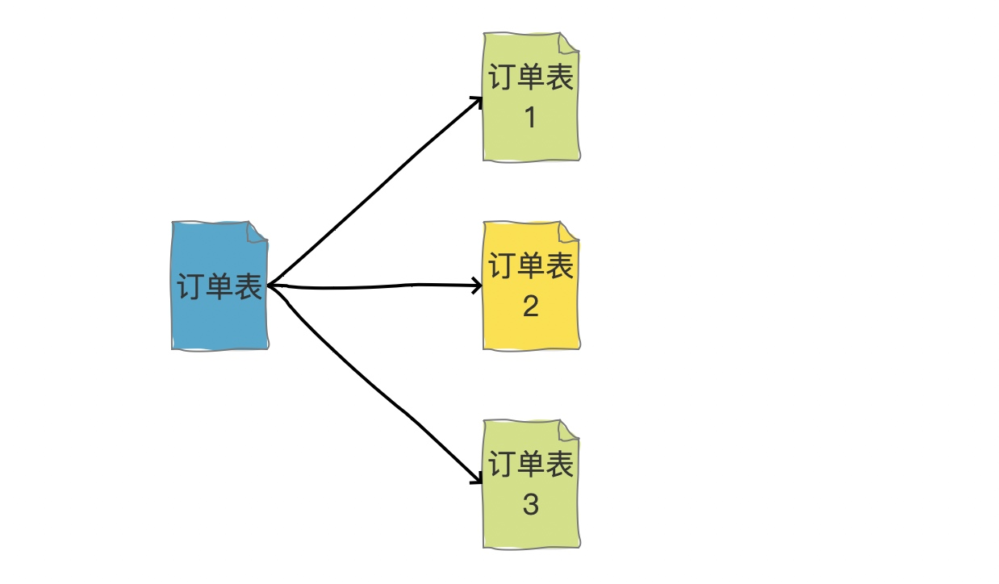
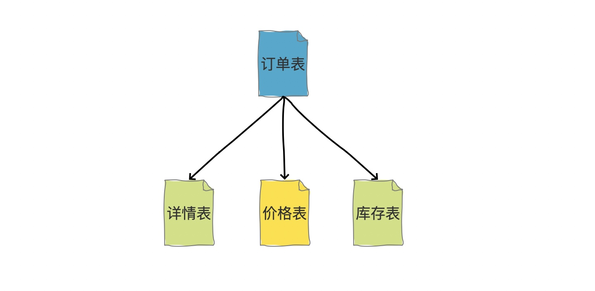

# ✅什么是分库？分表？分库分表？

# 典型回答

分库分表，是企业里面比较常见的针对高并发、数据量大的场景下的一种技术优化方案，**所谓"分库分表"，根本就不是一件事儿，而是三件事儿**，他们要解决的问题也都不一样。

****

这三个事儿分别是"只分库不分表"、"只分表不分库"、以及"既分库又分表"。

**分库主要解决的是并发量大的问题**。因为并发量一旦上来了，那么数据库就可能会成为瓶颈，因为数据库的连接数是有限的，虽然可以调整，但是也不是无限调整的。所以，当你的数据库的读或者写的QPS过高，导致你的数据库连接数不足了的时候，就需要考虑分库了，**通过增加数据库实例的方式来提供更多的可用数据库链接，从而提升系统的并发度。**

****

**分表主要解决的是数据量大的问题。**假如你的单表数据量非常大，因为并发不高，数据量连接可能还够，但是存储和查询的性能遇到了瓶颈了，你做了很多优化之后还是无法提升效率的时候，就需要考虑做分表了。

那么，当你的数据库链接也不够了，并且单表数据量也很大导致查询比较慢的时候，就需要做**既分库又分表**了。

# 扩展知识

## 分库、分表、分库分表

**分库主要解决的是并发量大的问题**。比较典型的分库的场景就是我们在做微服务拆分的时候，就会按照业务边界，把各个业务的数据从一个单一的数据库中拆分开，分别把订单、物流、商品、会员等数据，分别放到单独的数据库中。

还有就是有的时候可能会需要把历史订单挪到历史库里面去。这也是分库的一种具体做法。

#### 什么时候分表？

**分表主要解决的是数据量大的问题。通过将数据拆分到多张表中，来减少单表的数据量，从而提升查询速度。**

一般我们认为，单表行数超过 500 万行或者单表容量超过 2GB之后，才需要考虑做分库分表了，小于这个数据量，遇到性能问题先建议大家通过其他优化来解决。

PS：以上数据，是阿里巴巴Java开发手册中给出的数据，偏保守，根据实际经验来说，单表抗2000万数据量问题不大，但具体的数据里还是要看记录大小、存储引擎设置、硬件配置等。

[从B+树的角度估算一下单表的数据量？](https://www.yuque.com/hollis666/qfgwk3/ovg68pfik2vo2eh8)

那如果，既需要解决并发量大的问题，又需要解决数据量大的问题时候。通常情况下，高并发和数据量大的问题都是同时发生的，所以，我们会经常遇到分库分表需要同时进行的情况。

所以，当你的数据库链接也不够了，并且单表数据量也很大导致查询比较慢的时候，就需要做既分库又分表了。

## 横向拆分和纵向拆分

谈及到分库分表，那就要涉及到该如何做拆分的问题。

**通常在做拆分的时候有两种分法，分别是横向拆分（水平拆分）和纵向拆分(垂直拆分)。**假如我们有一张表，如果把这张表中某一条记录的多个字段，拆分到多张表中，这种就是纵向拆分。那如果把一张表中的不同的记录分别放到不同的表中，这种就是横向拆分。

横向拆分的结果是数据库表中的数据会分散到多张分表中，使得每一个单表中的数据的条数都有所下降。比如我们可以把不同的用户的订单分表拆分放到不同的表中。

纵向拆分的结果是数据库表中的数据的字段数会变少，使得每一个单表中的数据的存储有所下降。比如我可以把商品详情信息、价格信息、库存信息等等分别拆分到不同的表中。

还有我们谈到的针对不同的业务做拆分成多个数据库的这种情况，其实也是纵向拆分的一种。

## 分表字段如何选择？

[分表字段如何选择？](https://www.yuque.com/hollis666/qfgwk3/mec4ust5rpfob78r)

## 分表算法

[分表算法都有哪些？](https://www.yuque.com/hollis666/qfgwk3/anpg4kfcb8p7egag)

## 全局ID的生成

[分表后全局ID如何生成？](https://www.yuque.com/hollis666/qfgwk3/glyv4twwk6bfs6dr)

## 分库分表的工具

在选定了分表字段和分表算法之后，那么，如何把这些功能给实现出来，需要怎么做呢？

我们如何可以做到像处理单表一样处理分库分表的数据呢？这就需要用到一个分库分表的工具了。

目前市面上比较不错的分库分表的开源框架主要有三个，分别是sharding-jdbc、TDDL和Mycat

### Sharding-JDBC

现在叫ShardingSphere（Sharding-JDBC、Sharding-Proxy和Sharding-Sidecar这3款相互独立的产品组成）。它定位为轻量级Java框架，在Java的JDBC层提供的额外服务。它使用客户端直连数据库，以jar包形式提供服务，无需额外部署和依赖，可理解为增强版的JDBC驱动，完全兼容JDBC和各种ORM框架。

开源地址：[https://shardingsphere.apache.org](https://shardingsphere.apache.org)

### TDDL

TDDL 是淘宝开源的一个用于访问数据库的中间件， 它集成了分库分表， 读写分离，权重调配，动态数据源配置等功能。封装 jdbc 的 DataSource给用户提供统一的基于客户端的使用。

开源地址：[https://github.com/alibaba/tb_tddl](https://github.com/alibaba/tb_tddl)

### Mycat

Mycat是一款分布式关系型数据库中间件。它支持分布式SQL查询，兼容MySQL通信协议，以Java生态支持多种后端数据库，通过数据分片提高数据查询处理能力。

开源地址：[https://github.com/MyCATApache/Mycat2](https://github.com/MyCATApache/Mycat2)

> 更新: 2024-03-18 23:23:11  
> 原文: <https://www.yuque.com/hollis666/qfgwk3/wpus0g>