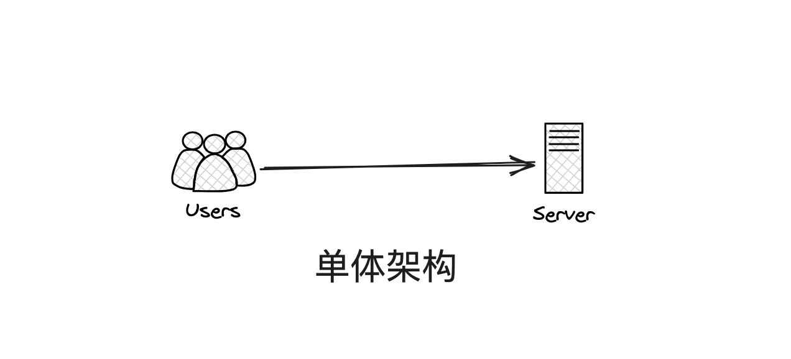

# ✅你认为分布式架构一定比单体架构要好吗？

# 典型回答

这种问题一问出来，答案肯定是不一定。因为他说的太绝对了。

单体架构就是把所有的东西都部署在一起，比如一个论坛系统，他把用户、发帖、评论、点赞、搜索等等全都部署在一个应用中。甚至有的更加极致的，把数据都部署在同一个服务器上面。

先来介绍下各自的优缺点。

单体架构的好处：

1、开发、测试部署都非常简单，只需要在一个项目中做开发，部署也只需要部署一个应用就行了。

2、不需要网络交互，除了和数据库、redis 之间的交互以外，应用的代码都在一起了，不需要通过 HTTP、RPC、MQ 等等去和其他的分布式系统交互，一个单体都搞定。那就能大大的降低网络延迟。

3、不需要考虑分布式问题。比如分布式事务、分布式锁、分布式 id 等等，完全不需要考虑，只需要解决好本地事务，单机并发就行了。

但是单体架构同样存在着一些缺点：

1、单机性能存在瓶颈，这个很容易理解，随着你的业务增长，对性能、存储等等的要求会越来越高，但是单机的硬件资源毕竟是有限的。

2、开发效率低。虽然单体的开发比较简单的，但是随着变动多的时候，效率也会有所影响，大家都在一个应用上开发，就会有各种互相影响，每次做代码合并的时候都会无比痛苦。还有就是单体的代码会越来越多，越来越庞大，到最后基本上很难改。

3、单点故障问题。单体应用大家都在一起，共用一个 JVM，共用内存，共用 CPU，一旦某个模块出了问题了，导致了 OOM、CPU 飙高等等，影响面会很大，把所有的功能都影响了。

4、技术栈单一，落后。很多单体都技术栈很旧，主要是因为大家的代码都在一起，各种功能都在一起了，你没啥发挥空间。还有就是很多东西你也用不上，像 MQ，单体你用它干啥呢？像分布式事务，你没有这个场景啊。

分布式架构的好处：

1、容易扩展，这个是最大的好处了。可以通过应用拆分、加机器的方式，快速的做扩展，抗更高的并发，更大的业务量。

2、模块化开发，互相独立。这个好处可太好了。大家互相不影响，你干你的，我干我的。互相只需要依赖一下对方的API 就行了。而且即使你的应用挂了，对我来说影响可能有，但是我不至于也跟着挂

3、减少了单点故障，这个比较好理解了。和上面这条类似。

4、技术栈多样。因为大家拆分的比较细，所以有格子的自主权，而且分布式各种场景的问题也都能遇到。

但是，他也有缺点的：

1、运维复杂：分布式系统，你就需要管理多个服务的部署、监控、日志、故障恢复等等。还得设计和实现服务发现机制和负载均衡策略。总之就是很多活需要干。

2、CAP：CAP理论大家都知道，这就是因为分布式带来的，随之而来的就是你可用性、一致性这些问题，伴随着的就是分布式事务、SLA等等这些技术问题的保障和解决。难！

3、问题分析，分布式系统，一个请求下来要经过很多不同的系统，一旦出现了问题，排查起来也挺复杂的，所以就需要引入分布式链路追踪的工具啥的。

**说了这么多区别，其实就是不同架构都有好处和坏处，各自都有使用的场景。对于一些项目规模较小，团队人数不多，开发周期短，技术要求不复杂的项目，单体就够了。**

而只有那些，项目规模大，需求复杂，业务增长快，需支持高并发和高可用性的，才需要考虑上分布式、微服务这些玩意。

> 更新: 2024-08-03 11:33:26  
> 原文: <https://www.yuque.com/hollis666/qfgwk3/otsd26qi3650x320>