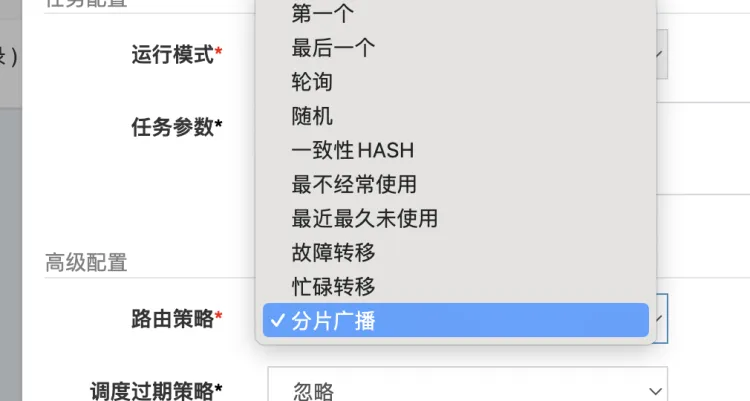

# ✅xxl-job 支持分片任务吗？实现原理是什么？

# 典型回答


支持！分片任务非常适用于处理大数据量的任务，其实就是可以将一个大任务划分为多个子任务并行执行，以提高效率。


分片任务能更好的利用集群的能力，可以同时调度多个机器并行运行任务。





分片任务的实现原理包括以下几个核心步骤：


1.  **任务分配**： 
    - 当一个分片任务被触发时，调度器会根据任务的分片参数决定需要多少个执行器参与任务。
    - 每个执行器或执行线程会接收到一个分片索引（shard index）和分片总数（shard total）。
2.  **分片参数**： 
    - 分片索引（从0开始）标识了当前执行器处理的是哪一部分数据。
    - 分片总数告诉执行器总共有多少个分片。
3.  **并行执行**： 
    - 每个执行器根据分配到的分片索引并行执行其任务。例如，如果一个任务被分为10个片，那么每个执行器可能负责处理10%的数据。
4.  **处理逻辑**： 
    - 开发者在任务实现时需要根据分片索引和分片总数来调整处理逻辑，确保每个分片处理正确的数据段。
5.  **结果汇总**： 
    - 分片执行完毕后，各个执行器的执行结果可以被独立处理，或者可以通过某种机制进行结果的汇总和整合。


当一个任务被分片任务调度的时候，会带着shardIndex和shardTotal两个参数过来，我们就可以解析这两个参数进行分片执行。

```plain
public ReturnT<String> orderTimeOutExecute() {
   
    int shardIndex = XxlJobHelper.getShardIndex();
    int shardTotal = XxlJobHelper.getShardTotal();

    if (userId % shardTotal == shardIndex) {
        // 执行任务
        System.out.println("执行任务: 用户 " + userId);
    } else {
        // 不执行任务
        System.out.println("用户 " + userId + " 不执行任务");
    }
}
```


举个例子，假如我们要处理用户订单的关闭任务，就可以用用户 id 对shardTotal取模，然后得到的结果如果和当前的shardIndex相等，则执行，否则不执行。


> 更新: 2024-06-11 23:55:04  
> 原文: <https://www.yuque.com/hollis666/qfgwk3/vnzzza8v69078qc1>