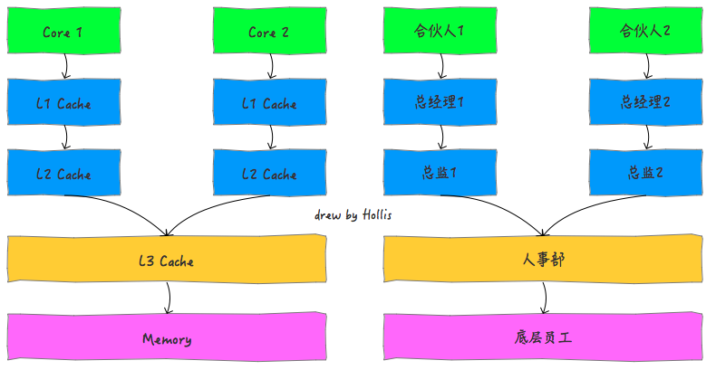

# ✅什么是操作系统的多级缓存

# 典型回答

我们应该都知道，计算机在执行程序的时候，每条指令都是在CPU中执行的，而执行的时候，又免不了要和数据打交道。而计算机上面的数据，是存放在主存当中的，也就是计算机的物理内存啦。

刚开始，还相安无事的，但是随着CPU技术的发展，CPU的执行速度越来越快。而由于内存的技术并没有太大的变化，所以从内存中读取和写入数据的过程和CPU的执行速度比起来差距就会越来越大,这就导致CPU每次操作内存都要耗费很多等待时间。

可是，不能因为内存的读写速度慢，就不发展CPU技术了吧，总不能让内存成为计算机处理的瓶颈吧。

所以，人们想出来了一个好的办法，就是在CPU和内存之间增加高速缓存。缓存的概念大家都知道，就是保存一份数据拷贝。他的特点是速度快，内存小，并且昂贵。

那么，程序的执行过程就变成了：

**当程序在运行过程中，会将运算需要的数据从主存复制一份到CPU的高速缓存当中，那么CPU进行计算时就可以直接从它的高速缓存读取数据和向其中写入数据，当运算结束之后，再将高速缓存中的数据刷新到主存当中。**

而随着CPU能力的不断提升，一层缓存就慢慢的无法满足要求了，就逐渐的衍生出多级缓存。

按照数据读取顺序和与CPU结合的紧密程度，CPU缓存可以分为一级缓存（L1），二级缓存（L2），部分高端CPU还具有三级缓存（L3），每一级缓存中所储存的全部数据都是下一级缓存的一部分。

这三种缓存的技术难度和制造成本是相对递减的，所以其容量也是相对递增的。

那么，在有了多级缓存之后，程序的执行就变成了：

**当CPU要读取一个数据时，首先从一级缓存中查找，如果没有找到再从二级缓存中查找，如果还是没有就从三级缓存或内存中查找。**

单核CPU只含有一套L1，L2，L3缓存；如果CPU含有多个核心，即多核CPU，则每个核心都含有一套L1（甚至和L2）缓存，而共享L3（或者和L2）缓存。

下图为一个单CPU双核的缓存结构。

> 更新: 2024-03-18 23:24:26  
> 原文: <https://www.yuque.com/hollis666/qfgwk3/nm0sde8ek7ccfg1w>