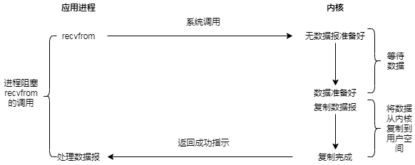
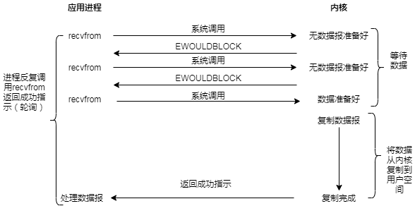
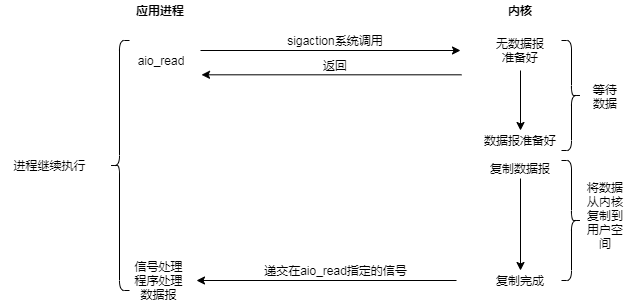

# ✅操作系统的IO模型有哪些？

# 典型回答
为了保护操作系统的安全，通过缓存加快系统读写，会将内存分为**用户空间和内核空间**两个部分。**如果用户想要操作内核空间的数据，则需要把数据从内核空间拷贝到用户空间（数据会放到内核空间的page cache中，这种也叫缓存IO）**。

举个栗子，如果服务器收到了从客户端过来的请求，并且想要进行处理，那么需要经过这几个步骤：

+ 服务器的网络驱动接受到消息之后，向内核申请空间，并在收到完整的数据包（这个过程会产生延时，因为有可能是通过分组传送过来的）后，将其复制到内核空间；
+ 数据从内核空间拷贝到用户空间；
+ 用户程序进行处理。



我们再详细的探究服务器中的文件读取，对于Linux来说，Linux是一个将所有的外部设备都看作是文件来操作的操作系统，在它看来：**everything is a file**，那么我们就把对与外部设备的操作都看作是对文件进行操作。而且我们对一个文件进行读写，都需要通过调用内核提供的系统调用。

而在Linux中，一个基本的IO会涉及到两个系统对象：一个是调用这个IO的进程对象（用户进程），另一个是系统内核。也就是说，当一个read操作发生时，将会经历这些阶段：

+ 通过read系统调用，向内核发送读请求；
+ 内核向硬件发送读指令，并等待读就绪；
+ DMA把将要读取的数据复制到指定的内核缓存区中；
+ **内核将数据从内核缓存区拷贝到用户进程空间中**。

  

正是由于上面的几个阶段，导致了file中的数据被用户进程消费是需要过程的，这也就延伸出了五种IO方式，分别是同步阻塞型IO模型、同步非阻塞型IO模型、IO复用模型、信号驱动模型以及异步IO模型

# 扩展知识

我们通过小J要去银行柜台办事，拿号排队的例子来分别说一下这五种IO模型。

## 同步阻塞IO模型
**从系统调用recv到将数据从内核复制到用户空间并返回，在这段时间内进程始终阻塞**。就相当于，小J想去柜台办理业务，如果柜台业务繁忙，他也要排队，直到排到他办理完业务，才能去做别的事。显然，这个IO模型是同步且阻塞的。



## 同步非阻塞IO模型
**在这里recv不管有没有获得到数据都返回，如果没有数据的话就过段时间再调用recv看看，如此循环**。就像是小J来柜台办理业务，发现柜员休息，他离开了，过一会又过来看看营业了没，直到终于碰到柜员营业了，这才办理了业务。而小J在中间离开的时间，可以做他自己的事情。但是这个模型只有在检查无数据的时候是非阻塞的，在数据到达的时候依然要等待复制数据到用户空间（办理业务），因此它还是同步IO。



## IO复用模型
**在IO复用模型中，调用recv之前会先调用select或poll，这两个系统调用都可以在内核准备好数据（网络数据已经到达内核了）时告知用户进程，它准备好了，这时候再调用recv时是一定有数据的。因此在这一模型中，进程阻塞于select或poll，而没有阻塞在recv上**。就相当于，小J来银行办理业务，大堂经理告诉他现在所有柜台都有人在办理业务，等有空位再告诉他。于是小J就等啊等（select或poll调用中），过了一会儿大堂经理告诉他有柜台空出来可以办理业务了，但是具体是几号柜台，你自己找下吧，于是小J就只能挨个柜台地找。



## 信号驱动IO模型
**此处会通过调用sigaction注册信号函数，在内核数据准备好的时候系统就中断当前程序，执行信号函数（在这里调用recv）**。相当于，小J让大堂经理在柜台有空位的时候通知他（注册信号函数），等没多久大堂经理通知他，因为他是银行的VIPPP会员，所以专门给他开了一个柜台来办理业务，小J就去特席柜台办理业务了。但即使在等待的过程中是非阻塞的，但在办理业务的过程中依然是同步的。



## 异步IO模型
**调用aio_read令内核把数据准备好，并且复制到用户进程空间后执行事先指定好的函数**。就像是，小J交代大堂经理把业务给办理好了就通知他来验收，在这个过程中小J可以去做自己的事情。这就是真正的异步IO。



我们可以看到，前四种模型都是属于同步IO，因为在内核数据复制到用户空间的这一过程都是阻塞的。而最后一种异步IO，通过将IO操作交给操作系统处理，当前进程不关心具体IO的实现，后来再通过回调函数，或信号量通知当前进程直接对IO返回结果进行处理。

# 知识扩展
## 什么是同步，异步，阻塞，非阻塞？
[🔜同步、异步、阻塞、非阻塞怎么理解？](https://www.yuque.com/hollis666/qfgwk3/bhoto944106qfong)

## 如何理解select，poll，epoll？
[📝如何理解select、poll、epoll？](https://www.yuque.com/hollis666/qfgwk3/vlsvn2xykt68fdg3)

> 更新: 2024-03-18 23:24:17  
> 原文: <https://www.yuque.com/hollis666/qfgwk3/rilxns8rh8gdxs78>