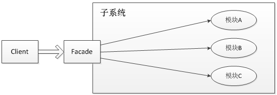

# ✅为什么不能直接使用Log4j、Logback中的 API？

# 典型回答


在Java生态体系中，围绕着日志，有很多成熟的解决方案。关于日志输出，主要有两类工具。


一类是日志框架（Log4j、Logback），主要用来进行日志的输出的，比如输出到哪个文件，日志格式如何等。 另外一类是日志门面（slf4j，commons-logging），主要一套通用的API，用来屏蔽各个日志框架之间的差异的。


对于Java工程师来说，关于日志工具的使用，最佳实践就是在应用中使用如Log4j + SLF4J 这样的组合来进行日志输出。


**这样做的最大好处，就是业务层的开发不需要关心底层日志框架的实现及细节，在编码的时候也不需要考虑日后更换框架所带来的成本。这也是门面模式所带来的好处。**


# 扩展知识
## 常用日志框架


### j.u.l


j.u.l是java.util.logging包的简称，是JDK在1.4版本中引入的Java原生日志框架。Java Logging API提供了七个日志级别用来控制输出。这七个级别分别是：SEVERE、WARNING、INFO、CONFIG、FINE、FINER、FINEST。


### Log4j


Log4j是Apache的一个开源项目，通过使用Log4j，我们可以控制日志信息输送的目的地是控制台、文件、GUI组件，甚至是套接口服务器、NT的事件记录器、UNIX Syslog守护进程等；我们也可以控制每一条日志的输出格式；通过定义每一条日志信息的级别，我们能够更加细致地控制日志的生成过程。最令人感兴趣的就是，这些可以通过一个配置文件来灵活地进行配置，而不需要修改应用的代码。


Log4j也有七种日志级别：OFF、FATAL、ERROR、WARN、INFO、DEBUG和TRACE。


### LogBack


LogBack也是一个很成熟的日志框架，其实LogBack和Log4j出自一个人之手，这个人就是Ceki Gülcü。


logback当前分成三个模块：logback-core,logback- classic和logback-access。logback-core是其它两个模块的基础模块。logback-classic是Log4j的一个改良版本。此外logback-classic完整实现SLF4J API使你可以很方便地更换成其它日记系统如Log4j或j.u.l。logback-access访问模块与Servlet容器集成提供通过Http来访问日记的功能。


### Log4j2 


前面介绍过Log4j，这里要单独介绍一下Log4j2，之所以要单独拿出来说，而没有和Log4j放在一起介绍，是因为作者认为，Log4j2已经不仅仅是Log4j的一个升级版本了，而是从头到尾被重写的，这可以认为这其实就是完全不同的两个框架。


关于Log4j2解决了Log4j的哪些问题，Log4j2相比较于Log4j、j.u.l和logback有哪些优势，我们在后续的文章中介绍。


前面介绍了四种日志框架，也就是说，我们想要在应用中打印日志的时候，可以使用以上四种类库中的任意一种。比如想要使用Log4j，那么只要依赖Log4j的jar包，配置好配置文件并且在代码中使用其API打印日志就可以了。


不知道有多少人看过《阿里巴巴Java开发手册》，其中有一条规范做了『强制』要求：


说好了以上四种常用的日志框架是给Java应用提供的方便进行记录日志的，那为什么又不让在应用中直接使用其API呢？这里面推崇使用的SLF4J是什么呢？所谓的门面模式又是什么东西呢？


## 什么是日志门面


日志门面，是门面模式的一个典型的应用。


门面模式（Facade Pattern），也称之为外观模式，其核心为：外部与一个子系统的通信必须通过一个统一的外观对象进行，使得子系统更易于使用。





就像前面介绍的几种日志框架一样，每一种日志框架都有自己单独的API，要使用对应的框架就要使用其对应的API，这就大大的增加应用程序代码对于日志框架的耦合性。


为了解决这个问题，就是在日志框架和应用程序之间架设一个沟通的桥梁，对于应用程序来说，无论底层的日志框架如何变，都不需要有任何感知。只要门面服务做的足够好，随意换另外一个日志框架，应用程序不需要修改任意一行代码，就可以直接上线。


在软件开发领域有这样一句话：计算机科学领域的任何问题都可以通过增加一个间接的中间层来解决。而门面模式就是对于这句话的典型实践。


## 为什么需要日志门面


前面提到过一个重要的原因，就是为了在应用中屏蔽掉底层日志框架的具体实现。这样的话，即使有一天要更换代码的日志框架，只需要修改jar包，最多再改改日志输出相关的配置文件就可以了。这就是解除了应用和日志框架之间的耦合。


有人或许会问了，如果我换了日志框架了，应用是不需要改了，那日志门面不还是需要改的吗？


要回答这个问题，我们先来举一个例子，再把门面模式揉碎了重新解释一遍。


日志门面就像饭店的服务员，而日志框架就像是后厨的厨师。对于顾客这个应用来说，我到饭店点菜，我只需要告诉服务员我要一盘番茄炒蛋即可，我不关心后厨的所有事情。因为虽然主厨从把这道菜称之为『番茄炒蛋』A厨师换成了把这道菜称之为『西红柿炒鸡蛋』的B厨师。但是，顾客不需要关心，他只要下达『番茄炒蛋』的命令给到服务员，由服务员再去翻译给厨师就可以了。


所以，对于一个了解了"番茄炒蛋的多种叫法"的服务员来说，无论后厨如何换厨师，他都能准确的帮用户下单。


同理，对于一个设计的全面、完善的日志门面来说，他也应该是天然就兼容了多种日志框架的。所以，底层框架的更换，日志门面几乎不需要改动。


以上，就是日志门面的一个比较重要的好处——解耦。


## 常用日志门面


介绍过了日志门面的概念和好处之后，我们看看Java生态体系中有哪些好的日志门面的实现可供选择。


### SLF4J


Java简易日志门面（Simple Logging Facade for Java，缩写SLF4J），是一套包装Logging 框架的界面程式，以外观模式实现。可以在软件部署的时候决定要使用的 Logging 框架，目前主要支援的有Java Logging API、Log4j及logback等框架。以MIT 授权方式发布。


SLF4J 的作者就是 Log4j 的作者 Ceki Gülcü，他宣称 SLF4J 比 Log4j 更有效率，而且比 Apache Commons Logging (JCL) 简单、稳定。


其实，SLF4J其实只是一个门面服务而已，他并不是真正的日志框架，真正的日志的输出相关的实现还是要依赖Log4j、logback等日志框架的。


由于SLF4J比较常用，这里多用一些篇幅，再来简单分析一下SLF4J，主要和Log4J做一下对比。相比较于Log4J的API，SLF4J有以下几点优势：


+  Log4j 提供 TRACE, DEBUG, INFO, WARN, ERROR 及 FATAL 六种纪录等级，但是 SLF4J 认为 ERROR 与 FATAL 并没有实质上的差别，所以拿掉了 FATAL 等级，只剩下其他五种。 
+  大部分人在程序里面会去写logger.error(exception),其实这个时候Log4j会去把这个exception tostring。真正的写法应该是logger(message.exception);而SLF4J就不会使得程序员犯这个错误。 
+  Log4j间接的在鼓励程序员使用string相加的写法（这种写法是有性能问题的），而SLF4J就不会有这个问题 ,你可以使用logger.error("{} is+serviceid",serviceid); 
+  使用SLF4J可以方便的使用其提供的各种集体的实现的jar。（类似commons-logger） 
+  从commons--logger和Log4j merge非常方便，SLF4J也提供了一个swing的tools来帮助大家完成这个merge。 
+  提供字串内容替换的功能，会比较有效率，说明如下： 

```plain
// 传统的字符串产生方式，如果没有要记录Debug等级的信息，就会浪费时间在产生不必要的信息上
logger.debug("There are now " + count + " user accounts: " + userAccountList);

// 为了避免上述问题，我们可以先检查是不是开启了Debug信息记录功能，只是程序的编码会比较复杂
if (logger.isDebugEnabled()) {
    logger.debug("There are now " + count + " user accounts: " + userAccountList);
}

// 如果Debug等级没有开启，则不会产生不必要的字符串，同时也能保持程序编码的简洁
logger.debug("There are now {} user accounts: {}", count, userAccountList);
```

 

+  SLF4J 只支持 MDC，不支持 NDC。 


### commons-logging


Apache Commons Logging是一个基于Java的日志记录实用程序，是用于日志记录和其他工具包的编程模型。它通过其他一些工具提供API，日志实现和包装器实现。


commons-logging和SLF4J的功能是类似的，主要是用来做日志 门面的。提供更加好友的API工具。


> 更新: 2024-12-21 13:17:21  
> 原文: <https://www.yuque.com/hollis666/qfgwk3/tai6nceh3x9qf8m6>