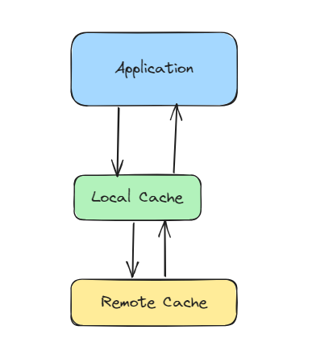
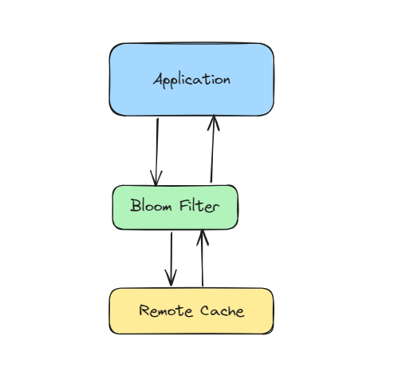

# ✅如何实现多级缓存？

# 典型回答
[✅说一说多级缓存是如何应用的？](https://www.yuque.com/hollis666/qfgwk3/kbizvh0kvqs8kldf)


本文重点说一说在Java应用中，多级缓存如何实现。


多级缓存是比较常见的一种性能优化的手段，一般来说就是本地缓存+分布式缓存。


本地缓存一般采用Caffeine和Guava，这两种是性能比较高的本地缓存的框架。他们都提供了缓存的过期、管理等功能。


分布式缓存一般采用Redis、Memcached等分布式缓存框架。


在做多级缓存的方案中，会先查询本地缓存，如果本地缓存查不到，再查询分布式缓存。并且在分布式缓存中查询到之后保存到本地缓存中一份。





有些特殊场景，如黑名单场景，本地缓存也会用bloom filter来充当，因为bloom filter是有假阳性的特性的，所以命中后需要在查一次分布式缓存，如果没命中则直接返回。




简单代码逻辑如下：


```plain
public String query(String key){

	String localResult = localCache.get(key);

	if(localResult == null){
  	String remoteResult = remoteCache.get(key);
  	if(remoteResult != null){
    	localCache.put(remoteResult);
    }
  }

	return localResult;

}
```


# 扩展知识


## 一致性问题


使用多级缓存，比较大的问题就是一致性如何保证，因为用到了本地缓存，而一个集群中有很多台服务器，每个服务器上面的本地缓存内容都不一样。


这个是使用本地缓存的最大的劣势了，但是这个问题是在提升性能的情况下不可避免的带来的副作用。


[✅如何保证本地缓存的一致性？](https://www.yuque.com/hollis666/qfgwk3/ianhl677i5grnp0f)


> 更新: 2024-03-18 23:23:09  
> 原文: <https://www.yuque.com/hollis666/qfgwk3/bqavbea1beb6nfud>