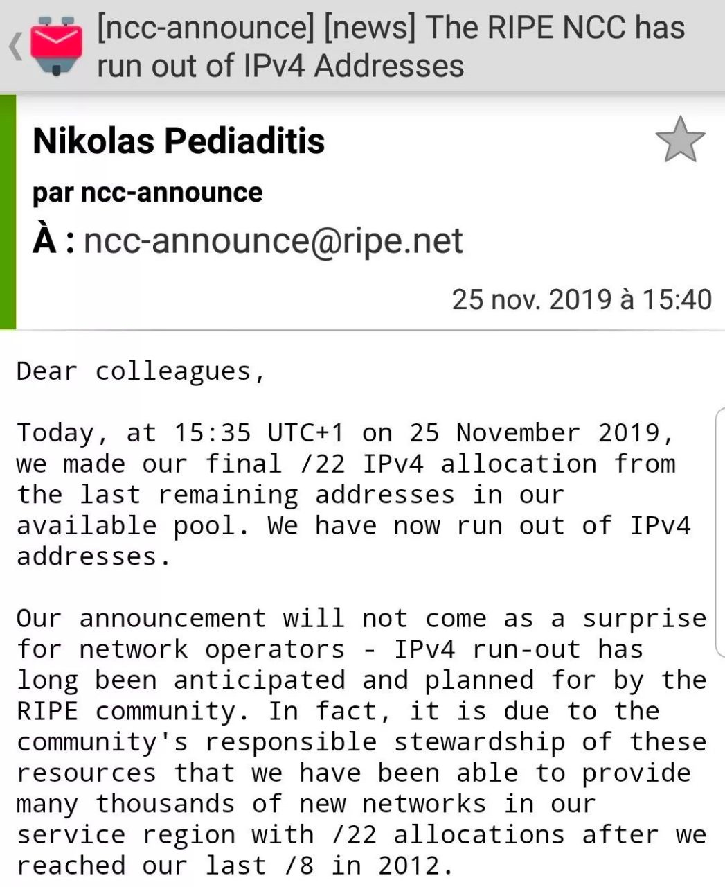
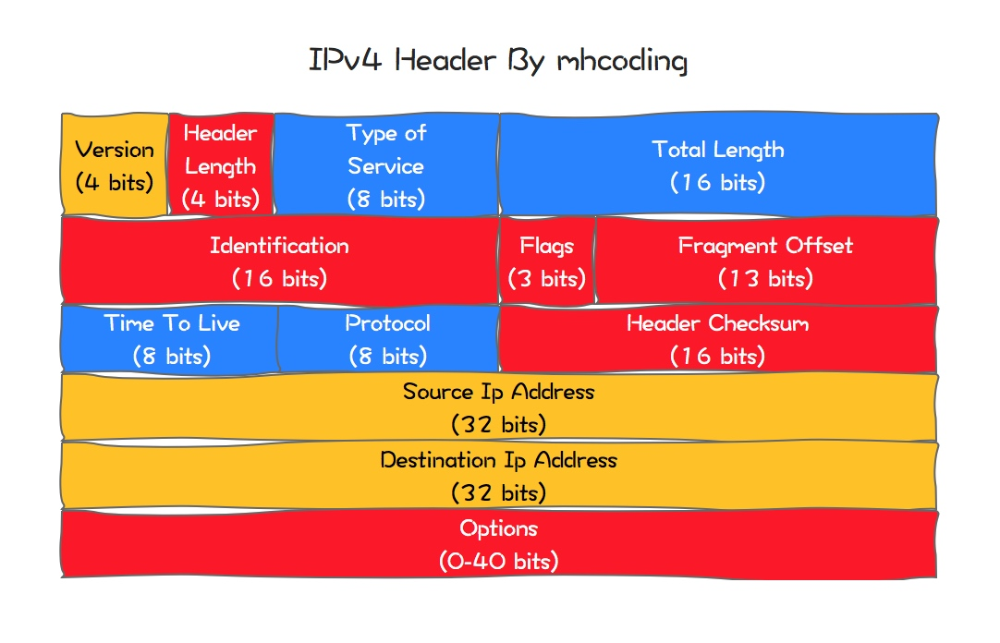
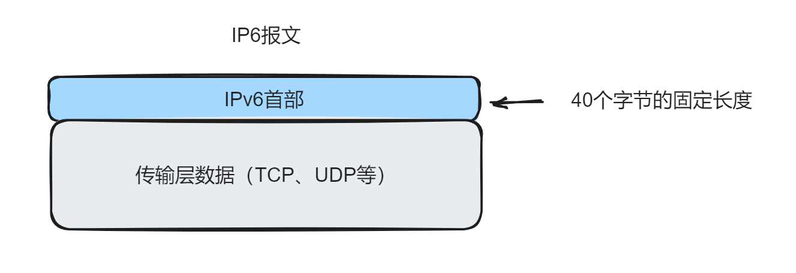
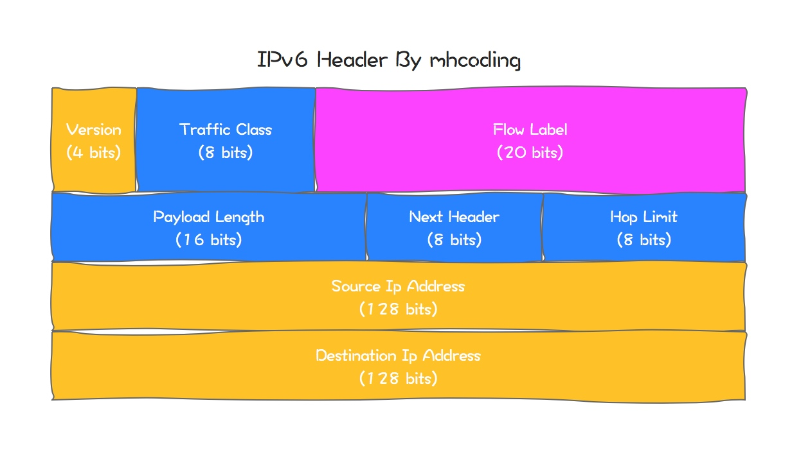
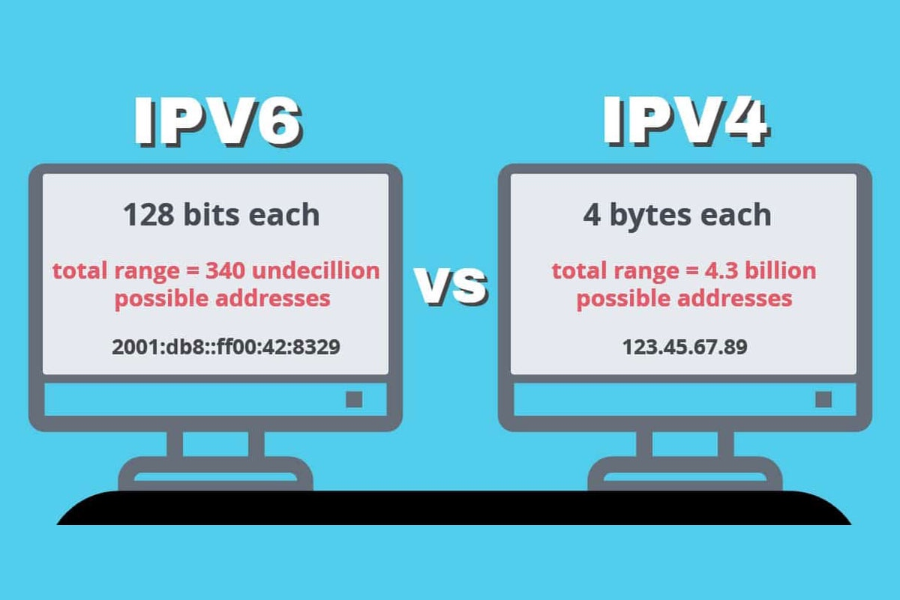
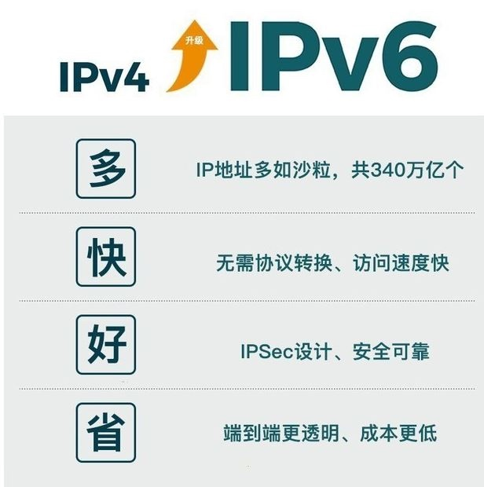
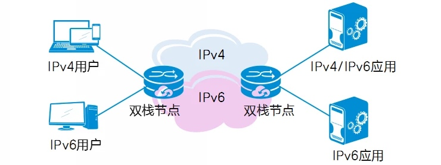
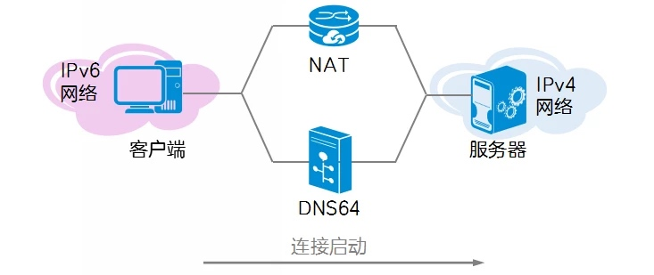

# ✅什么是IPV6？和IPV4有什么区别？

2019年11月25日，负责英国、欧洲、中东和部分中亚地区互联网资源分配的欧洲网络协调中心（RIPE NCC）宣布，其最后的 IPv4 地址空间储备池在 11 月 25 日 UTC + 1 15:35 完全耗尽，所有 43 亿个 IPv4 地址已分配完毕。





其实，早在20世纪80年代后期开始，全球已经开始意识到这个问题将会发生。IPv6的研发及布署，主要就是为了解决这个问题。


### 什么是IPv4？


IPv4是Internet Protocol version 4的缩写，中文翻译为互联网通信协议（TCP/IP协议）第四版，通常简称为网际协议版本4。





IPv4使用32位（4字节）地址，因此地址空间中只有4,294,967,296（2^32） 个地址。


IPv4地址可被写作任何表示一个32位整数值的形式，但为了方便人类阅读和分析，它通常被写作点分十进制的形式，即四个字节被分开用十进制写出，中间用点分隔。


所以，通常IPv4地址的地址格式为nnn.nnn.nnn.nnn，如：


```plain
192.0.2.235
```


因为在点分十进制的表达形势下，共有4个字节的IP地址被分位四段，每一段就有一个字节，而一个字节有8位，那么，8位能表示的数字范围是 0 - 255。


所以，一个IPv4的地址，格式为nnn.nnn.nnn.nnn，其中 0<=nnn<=255，而每个 n 都是十进制数。可省略前导零。


**IPv4报文格式**


我们知道，在TCP/IP 五层协议模型中，一次网络请求要先后经过应用层->传输层->网络层->数据链路层->物理层。


而在请求过程中，一个请求数据也会从应用层到物理层经过层层包装，每一层把上一层的数据报文包装后加上一层头部信息之后再传给下一层。


所以，IPv4作为网络层协议，在其报文结构中，同样包含了IP首部和数据部分。


其中，IPv4的首部长度是可变的，范围在20-60字节之间。


**首部**


IPv4报文的首部包含14个字段，其中13个是必须的，1个是可选的。





上图是一张IPv4报文的首部格式，可以看到，IPv4首部中包含的内容还是很多的，比如版本号，首部长度，标识符，分片偏移，存活时间，协议等。


由于这部分不是本文的重点，这里就不对报文头展开详细介绍了，读者可以参照上图自行学习下。


**数据**


报文中，除了首部以外，还有一个最重要的部分那就是数据部分，数据字段不是首部的一部分，因此并不被包含在首部检验和中。


前面说过，网络层会把传输层的报文封装成数据，并添加上首部之后传递给链路层。


所以，IPv4的报文中数据部分就是传输层的协议报文内容，如TCP、UDP等。


### 为什么IPv4会枯竭？


IP地址的全球性管理机构为互联网号码分配局（IANA），其下有五个局域网际网络注册管理机构（RIR）


在理论上，IPv4最多可以提供2^32 （约42.9亿）个IP地址。不过，一些地址是为特殊用途所保留的，如约1800万个专用网络和约2.7亿个多播地址，同样减少了可在互联网上路由的地址数量。


随着地址不断被分配给终端用户，IPv4地址枯竭问题也在随之产生。


中国是世界上互联网用户数量最多的国家，但人均只有0.45个IPv4地址。在IPv4的环境下，我国用户上网地址需要动态分配，人与地址没有固定的对应关系，用户溯源难，带来互联网安全和监管隐患。


所以，为了解决这个问题，IPv6诞生了。


### 什么是IPv6？


IPv6是Internet Protocol version 6的缩写，中文翻译为互联网通信协议（TCP/IP协议）第6版，通常简称为网际协议版6。IPv6具有比IPv4大得多的编码地址空间，用它来取代IPv4主要是为了解决IPv4地址枯竭问题，同时它也在其他方面对于IPv4有许多改进。


IPv6具有比IPv4大得多的编码地址空间。这是因为IPv6采用128位的地址，而IPv4使用的是32位。因此新增的地址空间支持2^128 个地址，具体数量为340,282,366,920,938,463,463,374,607,431,768,211,456个（不知道有没有人能把这个数读出来？）


有人说IPv6的地址数可能比全世界的沙子还要多，足以解决目前IPv4地址量不足的问题。


IPv6二进位制下为128位长度，以16位为一组，每组以冒号“:”隔开，可以分为8组


IPv6文本格式为 xxxx:xxxx:xxxx:xxxx:xxxx:xxxx:xxxx:xxxx，其中每个 x 都是十六进制数，表示 4 位。例如：


```plain
2001:0db8:86a3:08d3:1319:8a2e:0370:7344
```


**IPv6的报文格式**


和IPv4一样，IPv6的报文中同样包含首部和数据部分。





和IPv4不同的是，IPv6报文的首部是40个字节的固定长度。


下图是IPv6报文的首部的结构，IPv6定义了一种新的分组格式，目的是为了最小化路由器处理的消息标头。





从图中可以看出，和IPv4相比，IPv6的头部内容少了很多。


同样是网络层协议，IPv6和IPv4一样，都封装了传输层的报文内容作为自己的数据。这一点是没有任何差异的，所以我们可以说，在报文上，IPv6和IPv4的主要区别是报文头的区别。


### IPv4 VS IPv6


介绍完了IPv4和IPv6，我们再来整体看下这两种协议之间的区别。





**地址**


+  IPv4长度为 32 位（4 个字节）。 
    - IPv4 地址的文本格式为 nnn.nnn.nnn.nnn，其中 0<=nnn<=255，而每个 n 都是十进制数。可省略前导零。最大打印字符数为 15 个，不计掩码。
+  IPv6长度为 128 位（16 个字节）。 
    - IPv6 地址的文本格式为 xxxx:xxxx:xxxx:xxxx:xxxx:xxxx:xxxx:xxxx，其中每个 x 都是十六进制数，表示 4 位。可省略前导零。可在地址的文本格式中使用一次双冒号（::），用于指定任意数目的 0 位。例如，::ffff:10.120.78.40 表示 IPv4 映射的 IPv6 地址。


**地址解析协议**


+ IPv4 使用 ARP 来查找与 IPv4 地址相关联的物理地址（如 MAC 或链路地址）。
+ IPv6 使用因特网控制报文协议版本 6（ICMPv6）将这些功能嵌入到 IP 自身作为无状态自动配置和邻节点发现算法的一部分。因此，不存在类似于 ARP6 之类的东西。


**IP 报头** _ IPv4根据提供的 IP 选项，有 20-60 个字节的可变长度。 _ IPv6的报文头是 40 个字节的固定长度。没有 IP 报头选项。 * 通常，IPv6 报头比 IPv4 报头简单。


**安全性**


+ IPv6預設有IPSec，來提升安全性。
+ 相較之下，IPv4的IPSec則需要額外開啟。


**地址类型**


+ IPv4 地址分为三种基本类型：单点广播地址、多点广播地址和广播地址。
+ IPv6 地址分为三种基本类型：单点广播地址、多点广播地址和任意广播地址。有关描述，请参阅 IPv6 地址类型。


**专用地址和公用地址** _ IPv4除由 IETF RFC 1918 指定为专用的三个地址范围 10..._ (10/8)、172.16.0.0 至 172.31.255.255 (172.16/12) 和 192.168.. (192.168/16) 之外，所有 IPv4 地址都是公用的。专用地址域通常在组织内部使用。专用地址不能通过因特网路由。 _ IPv6 有类似的概念，但还有重要差别。地址是公用或临时的，先前称为匿名地址。 请参阅 RFC 3041。与 IPv4 专用地址不同，临时地址可进行全局路由。 _ 动机也不一样：IPv6 临时地址要在它开始通信时屏蔽其客户机的身份（涉及隐私）。临时地址的生存期有限，且不包含是链路（MAC）地址的接口标识。它们通常与公用地址没有区别。


**相比IPv4,IPv6主要有以下几个方面的优点**


+  1.更大的地址空间。IPv4中规定IP地址长度为32，即有2^32 -1个地址。而IPv6中IP地址的长度为128，即有2^128 -1个地址。 
+  2.更小的路由表。IPv6的地址分配遵循聚类原则，这使得路由器能在路由表中用一条记录表示一片子网，大大减少了路由器中路由表的长度，提高了路由器转发数据包的速度。 
+  3.增强的组播支持以及对流的支持。这使得网络上的多媒体应用有了长足发展的机会，为服务质量控制提供了良好的网络平台，加入了对自动配置的支持。这是对DHCP的改进和扩展，使得网络的管理更加方便和快捷。 
+  4.更高的安全性。在使用ipv6的网络中用户可以对网络层的数据进行加密并对IP报文进行校验，这极大地增强了网络安全。 


有人做了一个形象的总结，那就是『多快好省』





### IPv4向IPv6的转换


一方面因为IPv4的枯竭，另一方面也因为IPv6的"多快好省"，越来越多的企业开始选择使用IPv6。


那么，想要把IPv4网络转换到IPv6网络，需要做什么呢？


首先，可以明确的事，**IPv6并不是IPv4协议的的升级，而是一个全新的协议，二者之间是无法互相兼容的。**


为了保障IPv4向IPv6的顺利演进，国际互联网工程任务组（IETF）成立专门工作组进行研究，形成了三类技术方案：双栈技术、隧道技术、协议转换技术（NAT-PT）。


**双栈技术**


IPv4 和 IPv6 有功能相近的网络层协议，都是基于相同的硬件平台，同一个主机同时运行 IPv4 和 IPv6 两套协议栈，具有 IPv4/IPv6 双协议栈的结点称为双栈节点，这些结点既可以收发 IPv4 报文，也可以收发 IPv6 报文。它们可以使用 IPv4 与 IPv4 结点互通，也可以直接使用 IPv6 与 IPv6 结点互通。双栈节点同时包含 IPv4 和 IPv6 的网络层，但传输层协议（如 TCP 和 UDP）的使用仍然是单一的。


图源：[https://inews.gtimg.com/newsapp_bt/0/10497932033/1000](https://inews.gtimg.com/newsapp_bt/0/10497932033/1000)


双栈技术的优点：


+ 处理效率高、无信息丢失
+ 互通性好、网络规划简
+ 充分发挥 IPv6 协议的所有优点，更小的路由表、更高的安全性等。


双栈技术的缺点：


+ 无法实现 IPv4 和 IPv6 互通
+ 对网络设备要求较高，内部网络改造牵扯比较大，周期性相比较较长。
+ 资源占用多，运维复杂。


**隧道技术**


隧道技术指将另外一个协议数据包的报头直接封装在原数据包报头前，从而可以实现在不同协议的网络上直接进行传输，这种机制用来在 IPv4 网络之上连接 IPv6 的站点，站点可以是一台主机，也可以是多个主机。隧道技术将 IPv6 的分组封装到 IPv4 的分组中，或者把 IPv4 的分组封装到 IPv6 的分组中，封装后的 IPv4 分组将通过 IPv4 的路由体系传输或者 IPv6 的分组进行传输。


图源：[https://inews.gtimg.com/newsapp_bt/0/10497932035/1000](https://inews.gtimg.com/newsapp_bt/0/10497932035/1000)


隧道技术的优点：


+ 无信息丢失
+ 网络运维相比较简单
+ 容易实现，只要在隧道的入口和出口进行修改


隧道技术的缺点：


+ 隧道需要进行封装解封装，转发效率低。
+ 无法实现 IPv4 和 IPv6 互通
+ 无法解决 IPv4 短缺问题
+ NAT 兼容性不好


**协议转换技术**


协议转换技（NAT-PT）附带协议转换器的网络地址转换器。是一种纯 IPv6 节点和 IPv4 节点间的互通方式，所有包括地址、协议在内的转换工作都由网络设备来完成。NAT-PT 包括静态和动态两种，两者都提供一对一的 IPv6 地址和 IPv4 地址的映射，只不过动态 NAT-PT 需要一个 IPv4 的地址池进行动态的地址转换。


图源：[https://inews.gtimg.com/newsapp_bt/0/10497932041/1000](https://inews.gtimg.com/newsapp_bt/0/10497932041/1000)


**NAT-PT 技术的优点** 

+ 不需要进行 IPv4、IPv6 节点的升级改造


**NAT-PT 技术的缺点** 

+ IPv4 节点访问 IPv6 节点的实现方法比较复杂，网络设备进行协议转换、地址转换的处理开销较大一般在其他互通方式无法使用的情况下使用


双栈技术、隧道技术、协议转换技术在IPv4向IPv6过渡期间互相配合、协同工作，解决了过渡期间的IPv4与IPv6的共存和互通问题，保障了IPv4向IPv6的平滑演进。


有了以上的切换方法、切换原则和技术保障，以及顺应互联网的发展趋势，国家正积极推动IPv6的部署。


中国互联网信息中心（CNNIC）的第44次《中国互联网络发展状况统计报告》指出，截止2019年6月，我们国家的IPv6地址数量为50286块/32，已跃居全球第一位；IPv6活跃用户数达1.3亿，大概占我国互联网用户的15%。


### IPv6对中国的影响


中国比发达国家晚接入互联网20年，是互联网行业的后来者，虽然在互联网产品和互联网应用上是大国，但我们的操作系统还是国外的，我们在核心技术上仍有差距，想要在IPv4环境下进行技术创新，中国几乎没有什么机会了。


但是在IPv6上，我们跟发达国家起步差不多，我们是有机会的。


在IPv4时代，中国是没有根服务器的，新增几乎不可能。但是，由中国下一代互联网国家工程中心牵头发起的“雪人计划”已在全球完成25台IPv6根服务器架设，其中在中国境内就部署了其中的4台，打破了中国过去没有根服务器的困境。


另外，国际互联网有八千多个标准，在IPv4时代，中国只提了中文编码标准。但目前中国就IPv6提出了一百多个标准，可以说IPv6为中国互联网发展打开了一个新的创新空间。


所以，伴随着IPv4的枯竭，IPv6的大量投入使用，中国在国际互联网的地位一定会变得愈加重要！


> 更新: 2024-03-18 23:24:05  
> 原文: <https://www.yuque.com/hollis666/qfgwk3/dmed6y>