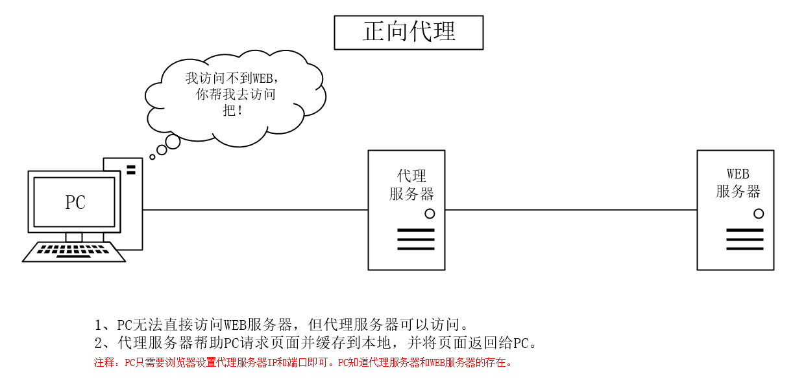

# ✅什么是正向代理和反向代理？

**正向代理（forward proxy）：是一个位于客户端和目标服务器之间的服务器(代理服务器)，为了从目标服务器取得内容，客户端向代理服务器发送一个请求并指定目标，然后代理服务器向目标服务器转交请求并将获得的内容返回给客户端。**

这种代理其实在生活中是比较常见的，比如科学上网技术，其用到的就是正向代理技术。

有时候，用户想要访问某国外网站，该网站无法在国内直接访问，但是我们可以访问到一个代理服务器，这个代理服务器可以访问到这个国外网站。这样呢，用户对该国外网站的访问就需要通过代理服务器来转发请求，并且该代理服务器也会将请求的响应再返回给用户。这个上网的过程就是用到了正向代理。

****

**所以，正向代理，其实是”代理服务器”代理了”客户端”，去和”目标服务器”进行交互。**

通过正向代理服务器访问目标服务器，目标服务器是不知道真正的客户端是谁的，甚至不知道访问自己的是一个代理。

**反向代理（reverse proxy）：是指以代理服务器来接受internet上的连接请求，然后将请求转发给内部网络上的服务器，并将从服务器上得到的结果返回给internet上请求连接的客户端，此时代理服务器对外就表现为一个反向代理服务器。**

对于常用的场景，就是我们在Web开发中用到的负载均衡服务器，客户端发送请求到负载均衡服务器上，负载均衡服务器再把请求转发给一台真正的服务器来执行，再把执行结果返回给客户端。

所以，**反向代理，其实是”代理服务器”代理了”目标服务器”，去和”客户端”进行交互。**

通过反向代理服务器访问目标服务器时，客户端是不知道真正的目标服务器是谁的，甚至不知道自己访问的是一个代理。

**正向代理和反向代理的区别**

虽然正向代理服务器和反向代理服务器所处的位置都是客户端和真实服务器之间，所做的事情也都是把客户端的请求转发给服务器，再把服务器的响应转发给客户端，但是二者之间还是有一定的差异的。

1、正向代理其实是客户端的代理，帮助客户端访问其无法访问的服务器资源。反向代理则是服务器的代理，帮助服务器做负载均衡，安全防护等。

2、正向代理，一般是客户端架设的，比如在自己的机器上安装一个代理软件。而反向代理一般是服务器架设的，比如在自己的机器集群中部署一个反向代理服务器。

3、正向代理中，服务器不知道真正的客户端到底是谁，以为访问自己的就是真实的客户端。而在反向代理中，客户端不知道真正的服务器是谁，以为自己访问的就是真实的服务器。

4、正向代理和反向代理的作用和目的不同。正向代理主要是用来解决访问限制问题。而反向代理则是提供负载均衡、安全防护等作用。二者均能提高访问速度。

> 更新: 2024-11-09 14:47:02  
> 原文: <https://www.yuque.com/hollis666/qfgwk3/lrlsklnaacsxoa9q>