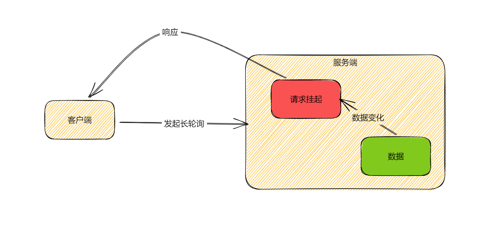

# ✅Nacos如何实现的配置变化客户端可以感知到？

# 典型回答

客户端与配置中心的数据交互方式其实无非就两种，要么推 ，要么就是拉 。

**推的模式**就客户端和服务端建立TCP长链接，当服务端数据发生变化，立即通过这个已经建立好的长连接将数据推送到客户端。

长链接的优点是实时性，一旦数据变动，客户端立即就能感知到。但是缺点就是服务端需要维护大量的TCP连接，这会占用大量的内存和CPU资源，同时也容易受到网络抖动等因素的影响。

**拉的模式**就是客户端轮询，通过不断轮询的方式检查数据是否发生变化，变化的话就把数据拉回来。

轮询的优点是实现比较简单，但弊端也显而易见，轮询无法保证数据的实时性，并且轮询方式对服务端还会产生压力。

****

**那Nacos使用的是哪种模式呢？**

****

**在Nacos1.x版本中采用的是长轮询，看好哦，不是长连接，也不是轮询，是**长轮询（Long Polling）。

在Nacos2.0中，采用gRPC长连接。

其实就是把长连接和轮询综合了一下，就是说客户端发起轮询，但是不立即返回，而是hold一段时间，这段时间保持着一个有效连接，超时或者变化再返回，然后再发起一次轮询。

# 扩展知识

## 长轮询
****

大概过程就是客户端向Nacos服务器发起一个长轮询请求，Nacos不会立即返回结果，而是会将请求挂起，直到有配置变化或者超时才会响应。当配置发生变化时，Nacos服务器会把变化后的配置信息响应客户端，并且客户端会再次发起一个新的长轮询请求。这样，客户端就能够实时感知到配置的变化。

这种方式避免客户端对服务端的不断轮询造成压力，也避免了长时间保持连接所带来的负担，同时也可以保证配置的实时性。但是，长轮询的缺点是需要频繁地发起HTTP请求，这会增加网络开销，同时也可能会受到网络延迟等因素的影响，导致配置的实时性不如长连接。

## 长轮询和长连接

**长轮询是一种实现异步消息通信的机制**，它通常用于客户端向服务器端请求某个资源时，如果服务器端没有即时可用的响应数据，就会将客户端的请求挂起，直到服务器端有了可用的响应数据，再将数据返回给客户端。因此，**长轮询的过程是客户端主动发起请求，服务器端被动响应请求。**

**长连接是指在客户端和服务器端之间建立一条持久连接**，通过该连接可以在一定时间内保持通信状态，避免了客户端频繁地建立和关闭连接所带来的额外开销。在长连接中，客户端和服务器端之间会保持一定的心跳机制，以确保连接的有效性。因此，**长连接的过程是由服务器端主动维护连接，客户端被动地接受服务器端的消息。**

在数据变化感知的实时性上面，长连接比长轮询要更加精准，感知的更快，长轮询也是有可能发生延迟的。

在协议层面上，长连接是基于TCP实现的，长轮询是基于HTTP实现的。

> 更新: 2024-03-18 23:22:44  
> 原文: <https://www.yuque.com/hollis666/qfgwk3/icbk1rndq13ku07o>